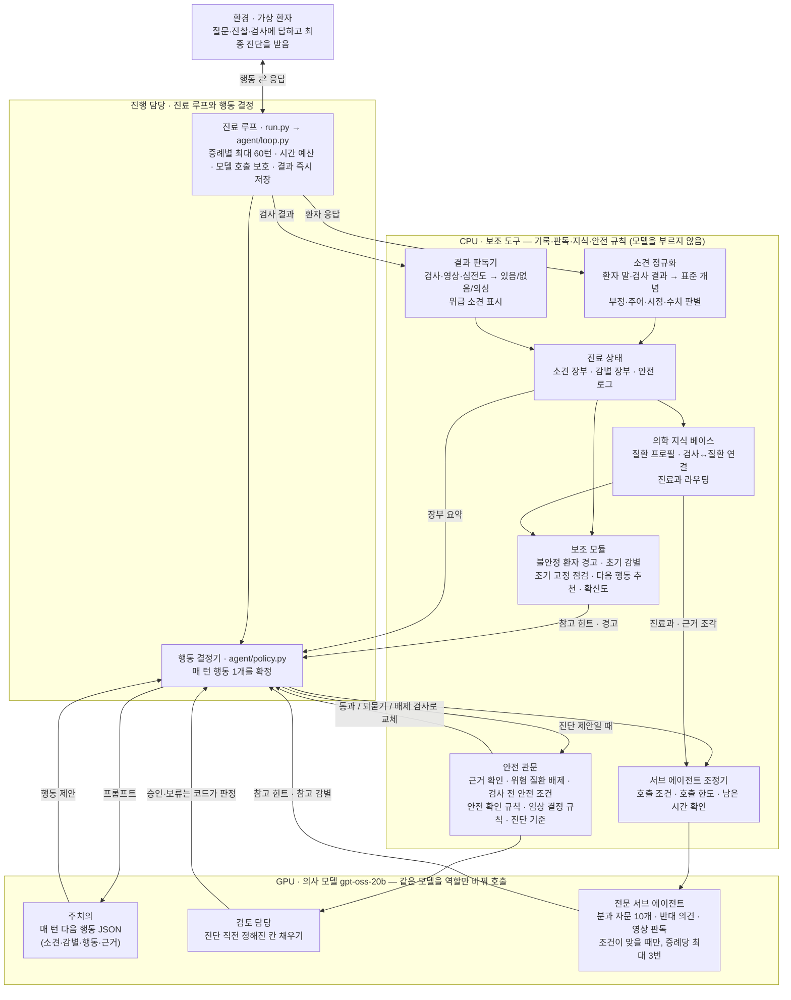
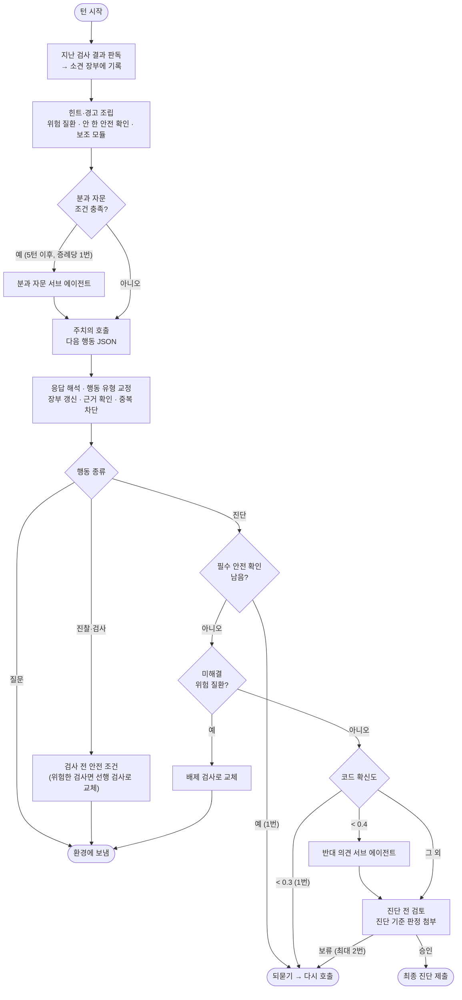

# Doctor-Agent

**작은 오픈 웨이트 언어모델(`openai/gpt-oss-20b`)로 움직이는 대화형 의료 진단 에이전트**를 만드는 개인 프로젝트입니다.
가상 환자에게 질문하고(ASK), 신체진찰(EXAM)과 검사(TEST)를 골라, 최종 진단(DIAGNOSE)에 도달하는 의사 에이전트입니다.

핵심 아이디어는 **"모델은 추론하고, 코드는 검증한다"** 와 **"효율적인 하드 코딩"** 입니다. 200억 매개변수급 모델이 60턴짜리 대화를 통째로 기억하고 안전 규칙까지 지키기는 어렵기 때문에, 소견 기록·위험 질환 배제·결과 판독·확신도 계산처럼 규칙으로 할 수 있는 일은 코드가 맡고, 언어모델은 매 턴 다음 행동 하나와 정해진 칸만 채웁니다. 그 규칙은 **적게, 출처가 있게, 한 곳에 모아** 만드는 것이 목표입니다([2.1](#21-핵심-아이디어-효율적인-하드-코딩)).
여기에 더해, 코드가 "지금 도움이 필요하다"고 판단한 순간에만 **같은 모델을 전문의·반대 의견 담당 역할로 한 번 더 불러**(전문 서브 에이전트), 주치의(주 진료 루프)가 놓칠 수 있는 감별과 검사를 짧은 참고 문장으로 받습니다. 서브 에이전트는 행동을 직접 고르지 않습니다([9장](#9-다중-에이전트-설계-주치의--전문-서브-에이전트)).

### 왜 작은 오픈 웨이트 모델인가

- **일부러 고른 제약입니다.** 큰 상용 모델이라면 많은 것을 모델에 맡길 수 있지만, 작은 모델은 한 대의 GPU에서 직접 돌릴 수 있고, 환자 정보가 외부 서비스로 나가지 않으며, 같은 가중치로 언제든 다시 재현할 수 있습니다. 이 프로젝트의 질문은 "작은 모델의 약점을 코드가 얼마나, 얼마나 적은 규칙으로 메울 수 있나"입니다.
- 모델은 손대지 않고 그대로 씁니다(파인튜닝 없음). 개선은 모두 프롬프트와 모델 바깥의 코드에서 합니다.
- 보조 도구(지식 베이스, 소견 해석, 결과 판독, 안전 규칙)는 CPU와 파이썬 표준 라이브러리만 씁니다. GPU는 언어모델 하나에만 씁니다.

### 핵심 정보

- 평가 틀: 우리가 정한 세 지표 — **진단 정확도 · 정보 획득 효율성 · 임상적 안전성**, 증례당 최대 60턴 (`eval/scorer.py`, [11장](#11-평가-도구))
- 목표 모델: `openai/gpt-oss-20b`, OpenAI 호환 엔드포인트(vLLM, Ollama `gpt-oss:20b`, 호스팅 API)라면 `.env`만 바꿔 연결
- 현재 프롬프트 버전: `v9-subagents` (`src/doctor_agent/agent/prompts.py`)

> ⚠ **가장 중요한 한계**: 언어모델로 실제 진료를 돌려 본 마지막 실험은 v5(제미나이 계열 모델, 2026-09-26)입니다.
> 그 뒤에 만든 것(지식 베이스 힌트, 안전 계층, 보조 모듈, 결과 판독기, 전문 서브 에이전트)은 **모델 없이** 규칙·데이터·가짜 의사(dummy)·과거 실행 기록 재생으로만 확인했습니다.
> 목표 모델 `gpt-oss-20b`로는 아직 한 번도 점수를 재지 못했습니다 ([현재 상태](#현재-상태)).

이 문서는 **지금까지 만든 기술과, 각 설계 결정의 근거가 된 데이터·측정값**을 정리한 것입니다.
모든 수치는 2026-09-28에 코드와 데이터에서 다시 세거나 다시 측정했고, 그 뒤 바뀐 수치와 새로 넣은 수치는 2026-09-29에 다시 쟀습니다. 다시 잴 수 없었던 것은 출처 문서와 날짜를 밝혔습니다 (명령과 값: [`docs/measurements.md`](docs/measurements.md)).

> **공개 저장소에 들어 있는 증례**: ClinicalQA에서 변환한 증례 95건([snuh/ClinicalQA](https://huggingface.co/datasets/snuh/ClinicalQA), Apache-2.0, 이 프로젝트가 변환·보강해 수정함)과 자체 합성 연습 증례 16건, 합계 **111건**(`data/cases_aug/`)입니다.
> 개발 중에는 여기에 AgentClinic-MedQA·DiagnosisArena에서 변환한 증례 156건을 더한 **267건**으로 평가했지만, 이 두 세트는 재배포 근거가 없어 **비공개로 평가에만 쓰고 이 저장소에는 넣지 않았습니다**([12.1](#121-증례-세트-평가-전용-실행-코드는-읽지-않음)).
> 그래서 이 문서에서 **"267증례"·"held-out(보류 세트)"으로 적힌 수치는 비공개 세트를 포함한 측정값**이고, 공개된 데이터만으로는 그대로 재현되지 않습니다. 공개분 111건으로 다시 잰 값은 해당 표에 따로 적었습니다(5.3, 7.5, 12.1).

---

## 아키텍처

한 문장으로 요약하면 **"주치의(gpt-oss-20b)는 다음 행동만 제안하고, 기억·판독·안전 검사는 코드가 맡으며, 필요한 순간에만 같은 모델을 전문의 역할로 한 번 더 부른다"** 입니다.

### 전체 구조



**읽는 법**

진행 담당과 보조 도구는 둘 다 코드이고, **맡은 역할**이 다릅니다. 진행 담당은 진료를 **진행**하고(순서 진행, 모델 호출, 행동 확정), 보조 도구는 진행에 필요한 **재료와 검사를 제공**합니다. 보조 도구는 모두 스위치로 끌 수 있어, 꺼도 진료는 진행되지만 모델 혼자 기억하고 판단해야 합니다.

| 구역 | 역할 | 왜 이렇게 나눴나 |
|---|---|---|
| **GPU · 의사 모델** | 판단이 필요한 일만 합니다: 다음 행동 제안(주치의), 진단 직전 검토 칸 채우기(검토 담당), 조건부 전문가 의견(서브 에이전트) | GPU는 언어모델 하나에만 쓰고(보조 도구는 CPU), 20B 모델은 긴 대화를 통째로 기억하거나 안전 규칙을 빠짐없이 지키기 어렵습니다 |
| **CPU · 보조 도구** | 기록 정리(장부), 해석(소견 정규화·결과 판독), 지식 조회, 안전 규칙 검사, 서브 에이전트 호출 조건 판단. **스스로 진료를 진행하지 않고, 진행 담당이 불러야 일합니다** | 규칙으로 할 수 있는 일은 코드가 해야 매번 같은 결과가 나오고, 근거를 인용하고 검증할 수 있습니다. 모두 표준 라이브러리만 쓰고 CPU에서 돕니다 |
| **진행 담당 · 행동 결정기** | 모델 제안과 보조 도구의 검사 결과를 합쳐 이번 턴의 행동 하나를 확정 | 모델은 **제안**만 하고, 승인·보류·교체는 **코드가 판정**합니다 |
| **진행 담당 · 진료 루프** | 증례를 하나씩 받아 턴을 돌리고, 모델을 부르고, 시간·오류를 관리하며, 무슨 일이 있어도 진단을 냅니다. 증례마다 새 상태로 시작합니다 | 증례 간 정보 공유 없음, 모든 증례에서 모델을 1번 이상 호출한다는 설계 원칙을 구조로 보장합니다([13장](#13-설계-제약과-라이선스-장부)) |

- **서브 에이전트는 행동을 직접 고르지 않습니다.** 참고 힌트와 "참고" 감별만 돌려주고, 주치의가 직접 채택해야 감별 목록에 들어갑니다([9장](#9-다중-에이전트-설계-주치의--전문-서브-에이전트)).
- **모든 계층은 스위치로 끌 수 있습니다.** 그래서 gpt-oss-20b로 계층별 효과를 따로 잴 수 있습니다([3.4](#34-설정-스위치와-비교-실험-조건)).

### 한 턴의 흐름



- 한 턴에 **주치의 호출은 최대 4번**까지 다시 시도합니다. 해석 실패, 중복, 되묻기가 나올 때마다 고칠 점을 힌트로 덧붙입니다. 4번 모두 실패하면 최종 진단 프롬프트로 넘어갑니다.
- 모든 단계는 예외가 나도 증례를 멈추지 않고, 무엇을 왜 했는지 안전 로그에 한국어로 남깁니다.
- 단계별 자세한 조건과 한도는 [3.2](#32-턴마다의-결정-순서-policynext_action-현재-코드-그대로)에 있습니다.

---

## 현재 상태

| 구분 | 상태 |
|---|---|
| 언어모델로 잰 진료 성능 | **v5까지만** (제미나이 계열, ClinicalQA 40증례 정확도 0.99, 2026-09-26) |
| v6 이후 (지식 베이스 힌트, 코드 판정 검토, 26개 안전 확인, 267증례 세트(공개분 111증례), 안전 계층, 보조 모듈, 결과 판독기, 전문 서브 에이전트) | **모델 없이** 단위 시험·오프라인 평가·가짜 의사·과거 경로 재생으로만 확인 |
| 목표 모델 `gpt-oss-20b` | **한 번도 측정 안 함**. 모든 프롬프트는 제미나이 기준으로 쓰였고 다시 검증해야 함. 확신도 되묻기 기준 0.3, 서브 에이전트 호출 문턱(5턴, 0.6, 0.4)도 제미나이·젬마 경로로만 정함 |
| 서브 에이전트의 효과 | **측정 전**. 호출 조건의 오프라인 근거는 서로 다른 오답 증례 12개뿐([9.3](#93-호출-조건과-오프라인-근거)) |
| 오프라인 지표 중 낙관적인 것 | 결과 판독기 1.00(작성자가 같은 세트), 어휘집 정답 세트 v1 F1 0.945(개발 중 본 세트), 지식 베이스 dev 수치 → 정직한 값은 각각 0.879, 0.882, held-out 0.147(1위) |

개발은 로컬 GPU 없이 진행해서, 언어모델이 필요한 실험은 제미나이·젬마 계열 API로 대신했습니다. 그래서 지금 이 저장소가 보여 줄 수 있는 것은 **설계와 코드, 그리고 모델 없이 잰 부품별 수치**이고, 목표 모델에서의 점수는 비어 있습니다. 이 빈칸을 채우는 순서는 [15장](#15-다음-단계와-알려진-약점)에 있습니다.

---

## 빠른 시작

```bash
python3 -m venv .venv && source .venv/bin/activate
pip install -r requirements.txt -r requirements-dev.txt
cp .env.example .env        # 모델 주소·API 키 입력 (.env는 git에 올라가지 않음)
```

| 할 일 | 명령 |
|---|---|
| 모델 없이 동작 확인 | `python eval/run_local.py --doctor dummy --patient keyword --judge none` |
| 표준 실험, 로컬 gpt-oss-20b (비용 추정 → 실행 → 비교 → 뷰어) | `python eval/experiment.py --profile smoke --doctor-endpoint local` |
| 표준 실험, `.env`의 `DOCTOR_LLM_*` 엔드포인트 | `python eval/experiment.py --profile smoke --doctor-endpoint env` |
| 비용만 미리 보기 | `python eval/experiment.py --profile dev --doctor-endpoint env --estimate-only` |
| 표준 평가 세트로 평가 | `python eval/run_local.py --cases data/cases_aug/clinicalqa` |
| 까다로운 환자로 평가 | `python eval/run_local.py --persona mixed` |
| 두 실행 비교 | `python eval/compare.py --latest 2` |
| 결과 보기 (브라우저) | `python eval/viewer.py` |
| 직접 진료해 보기 | `python eval/play.py` (내가 의사) · `python eval/play.py --role patient` (내가 환자) |
| 증례 묶음 실행 (견고 모드: 어떤 예외도 증례를 멈추지 않음, `--dev`로 끔) | `python run.py --cases data/sample_cases` |
| 자동 시험 | `pytest` |

오프라인 측정 명령(지식 베이스, 어휘집, 결과 판독기, 토큰 예산, 분과 라우팅, 호출 조건 재생 등)은 [11장](#11-평가-도구)에 있습니다.

**모델 설정**: 역할별 모델 변수는 [10.1](#101-연결과-안정성)에 있습니다. 모두 OpenAI 호환 방식이라 `.env`만 바꾸면 됩니다. 실험 도구의 `--doctor-endpoint`는 `env`(기본, `DOCTOR_LLM_*`), `local`(`LOCAL_LLM_*` 또는 Ollama `gpt-oss:20b`), `gemini`(`GEMINI_LLM_*`), `dummy`(모델 없음) 중 하나입니다. 코드 기본값은 로컬 Ollama `gpt-oss:20b`입니다.

---

## 목차

0. [아키텍처](#아키텍처) (그림 두 장)
1. [한눈에 보기](#1-한눈에-보기)
2. [설계 원칙](#2-설계-원칙) · [핵심 아이디어: 효율적인 하드 코딩](#21-핵심-아이디어-효율적인-하드-코딩)
3. [전체 구조와 턴마다의 결정 순서](#3-전체-구조와-턴마다의-결정-순서)
4. [안전 계층](#4-안전-계층)
5. [소견 정규화 계층 (자연어 해석)](#5-소견-정규화-계층-자연어-해석)
6. [검사 결과 판독기](#6-검사-결과-판독기)
7. [의학 지식 베이스](#7-의학-지식-베이스)
8. [확신도 · 조기 고정 점검 · 다음 행동 추천](#8-확신도--조기-고정-점검--다음-행동-추천)
9. [다중 에이전트 설계: 주치의 + 전문 서브 에이전트](#9-다중-에이전트-설계-주치의--전문-서브-에이전트)
10. [언어모델 다루기와 프롬프트 토큰 예산](#10-언어모델-다루기와-프롬프트-토큰-예산)
11. [평가 도구](#11-평가-도구)
12. [데이터 파이프라인 · 재현성 · 증례 세트](#12-데이터-파이프라인--재현성--증례-세트)
13. [설계 제약과 라이선스 장부](#13-설계-제약과-라이선스-장부)
14. [개발 방식과 자동 시험](#14-개발-방식과-자동-시험)
15. [다음 단계와 알려진 약점](#15-다음-단계와-알려진-약점)
16. [문서 안내](#16-문서-안내)

**용어**: 이 문서에서 **서브 에이전트**는 같은 의사 모델을 다른 역할로 한 번 더 부르는 것(분과 자문 · 반대 의견 · 영상 판독)이고, **보조 모듈**은 모델을 부르지 않고 코드만으로 참고 문장을 만드는 것(불안정 환자 경고, 결과 판독 한 줄, 조기 고정 점검, 초기 감별 목록, 다음 행동 추천)입니다. 근거의 **확인 수준**은 원문 / 2차 자료 / 미확인의 세 단계입니다([4.9](#49-근거-확인-수준-두-차례-검증)).

---

## 1. 한눈에 보기

| 구성 요소 | 규모 (2026-09-29 기준, 코드·데이터에서 직접 셈) | 자세히 |
|---|---|---|
| 주호소별 안전 확인 규칙 | 26개 주호소 분류, 확인 항목 88개(확인 수준 원문 61), 놓치면 안 되는 질환 112개, 근거 지침 46개 | [4.5](#45-주호소별-안전-확인-safetyprotocolspy) |
| 임상 결정 규칙 | 24개 (Wells, HEART, PECARN 등), 각각 원 논문의 적용 대상 조건 포함, 미확인 0 | [4.6](#46-임상-결정-규칙-knowledgeclinical_rulespy) |
| 진단·분류 기준 판정기 | 15개 (SLE, RA, Duke-ISCVID, Sepsis-3 등) | [4.7](#47-진단분류-기준-판정기-knowledgediagnostic_criteriapy) |
| 전문 서브 에이전트 | 분과 자문 10개(심장·호흡기감염·소화기간·신경·류마티스면역·소아산부인과·혈액종양·신장비뇨·내분비대사·정신) + 반대 의견 + 영상 판독. 같은 의사 모델을 다른 역할로 증례당 최대 3번 추가 호출 | [9장](#9-다중-에이전트-설계-주치의--전문-서브-에이전트) |
| 분과 라우팅 | 진단명 → 10개 분과. 사람이 만든 정답 207개 이름에서 엄격 일치 98.6% (첫 채점 98.1%) | [9.5](#95-분과-라우팅과-분과별-분포-knowledgespecialtypy) |
| 위험 질환 배제 관문 | 위험 질환 21개의 배제·확진 판정 규칙, 위급 영상·심전도 소견 11개 연결 | [4.2](#42-위험-질환-배제-관문-safetydanger_gatepy) |
| 검사 전 안전 조건 | 12개 규칙 (요추천자 전 뇌 CT, 조영제 전 신기능 등) | [4.3](#43-검사-전-안전-조건-safetypreconditionspy) |
| 소견 어휘집 | 개념 634개, 표현 6,855개, 정규식 152개, 차단어 57개 | [5장](#5-소견-정규화-계층-자연어-해석) |
| 의학 지식 베이스 | 질환 프로필 14,517개, 용어 10,953개, KCD 코드 21,124개, 검사 결과→질환 연결 452개 | [7장](#7-의학-지식-베이스) |
| 실행 데이터 | `data/kb` ≈ 3.5MB + `data/lexicon` ≈ 0.4MB, 가중치·벡터 색인 없음 | [13장](#13-설계-제약과-라이선스-장부) |
| 자동 시험 | 1,385개 (`pytest`, 2026-10-06 정리 후) | [14장](#14-개발-방식과-자동-시험) |

---

## 2. 설계 원칙

| 원칙 | 구체적인 방법 |
|---|---|
| **턴 예산** | 최대 60턴. 효율성 점수가 있으므로 목표 20턴을 넘으면 "충분히 확신하면 진단하라"는 안내를 붙임 |
| **안전 우선** | 진단 전에 위험 질환을 질문·검사로 배제. 되묻기, 배제 관문, 진단 전 검토의 세 겹 |
| **결코 멈추지 않음** | 모델 오류·시간 부족·환경 오류가 나도 모든 증례에 진단을 내고, 결과는 증례마다 즉시 저장 |
| **증례 독립** | 모든 상태를 증례마다 새로 만듦. 증례 사이 캐시·학습 없음 (지식 베이스는 읽기 전용 고정 데이터) |
| **작은 모델 친화** | 긴 대화 대신 "소견 장부 + 감별 장부 + 최근 4턴"만 보여 주고, 판정(승인·보류·이름 변경)은 코드가 내림 |
| **근거는 참고용** | 지식 베이스·규칙·보조 모듈·서브 에이전트의 출력은 모두 "참고" 표시로 넣어 확진 근거와 구분 |
| **필요할 때만 부르는 전문가** | 서브 에이전트는 코드가 정한 조건에서만, 증례당 최대 3번, 같은 의사 모델로 호출. 행동·진단은 주치의가 정함 ([9.1](#91-구조)) |
| **CPU 전용 부가 계산** | GPU는 언어모델 전용. 지식 베이스·어휘집·판독기는 파이썬 표준 라이브러리만 쓰고 CPU에서 동작 |

### 2.1 핵심 아이디어: 효율적인 하드 코딩

작은 고정 모델의 약점을 규칙으로 보완하는 것 자체는 새롭지 않습니다. 이 프로젝트가 중요하게 보는 것은 **그 규칙을 얼마나 적게, 정확하게, 일반화되게 만드느냐**입니다. 규칙이 많아질수록 프롬프트에 잡음이 늘고, 모듈끼리 모순되고, 가진 증례에만 맞는(과적합) 위험이 커지기 때문입니다.

| 원칙 | 뜻 | 현재 상태 (2026-09-30) |
|---|---|---|
| **1. 지식은 한 곳에** | 위험 질환·참고치·부정 표현 같은 지식을 표 하나에 두고 모든 모듈이 공유 | ❌ 부정 판별 6곳, 위험 질환 목록 4곳, 성별 판별 4곳, qSOFA 계산 4곳에 중복 |
| **2. 지식은 데이터로, 엔진은 작게** | 규칙은 표(JSON 등)로 적고, 표를 읽어 판정하는 코드는 작고 일반적으로 | ❌ 약 4,400줄의 규칙 표·인용이 코드 안에 있음 |
| **3. 출처가 있는 지식만** | 진료 지침·논문에서 가져오고 출처와 확인 수준(원문/2차 자료/미확인)을 기록 | ✅ 대부분 인용과 확인 수준이 있음 ([4.9](#49-근거-확인-수준-두-차례-검증)) |
| **4. 손으로 쓰기보다 생성하기** | 공개 자료·지침에서 규칙을 뽑아내고 사람은 검토만 함 (외부 LLM은 오프라인 데이터 처리에만 쓰고 실행 코드에서는 부르지 않음) | △ 지식 베이스는 생성, 안전 규칙은 수작업 |
| **5. 쓰이는 것만 남기기** | 실제로 발동하고 점수를 올리는 규칙만 남김 | △ 발동 횟수는 측정(예: 임상 결정 규칙 24개 중 10개는 267증례에서 발동 0), 점수 기여는 gpt-oss-20b로 측정 예정 |
| **6. 특정 증례에 맞추지 않기** | 문장 하나를 고치는 땜질 대신 일반 규칙으로 고치고, 새 데이터로 처음 채점한 값만 믿음 | △ 원칙은 적용 중이나 과거의 개별 패치(예외 표, 차단어 일부)가 남아 있음 |

**정리 순서**: (1) gpt-oss-20b로 잴 수 있게 되면 모든 부품을 하나씩 꺼 보고, 정확도나 안전성을 올리지 못하는 부품을 뺍니다(원칙 5). (2) 남은 부품의 지식을 **위험 질환·배제 조건 표, 참고치·수치 기준 표, 자연어 개념 사전**의 세 표로 합칩니다(원칙 1·2). (3) 표를 자동 생성하고 사람이 검토하는 방식으로 바꿀 수 있는 부분을 찾습니다(원칙 4). 합치기 전에 먼저 줄여야 나중에 뺄 부품까지 정리하는 낭비가 없습니다.

**지금까지 한 정리** (2026-09-30): 쓰이지 않는 코드와 오프라인 전용 코드 약 670줄을 실행 코드에서 빼고(오프라인 코드는 `scripts/`로 이동), 중복된 JSON 추출기 4개를 하나로 합쳤으며, 결과 판독기의 옛 우회 코드를 지워 수치 판정을 한 곳(`knowledge/kb_tests.py`)으로 모았습니다. 모두 프롬프트·결과가 바이트 단위로 같은지(버그 수정 제외) 확인했습니다.

---

## 3. 전체 구조와 턴마다의 결정 순서

### 3.1 모듈 구성

```
run.py ── 증례 공급원 (env/factory.py: local)                   ← 다른 환경은 env/interface.py 뒤에 어댑터만 추가
  │        env.reset() / env.step(action)
  ▼
run_case (agent/loop.py) ── 증례별 시간 예산 + 보호된 모델 호출 (agent/runtime.py) ── 모델 연결 (llm/)
  │                                                                              OpenAI 호환, gpt-oss 응답 형식 처리
  ▼
Policy.next_action (agent/policy.py) ── 매 턴 행동 하나 결정
  │  힌트 ◄── safety/protocols.py          주호소별 위험 질환 + 아직 안 한 안전 확인
  │       ◄── knowledge/clinical_rules.py   해당되는 임상 결정 규칙 최대 2개
  │       ◄── agent/kb_hints.py ◄── knowledge/kb.py (+ kb_curated.py, kb_tests.py, data/kb/)
  │  보조 ◄── safety/triage.py (불안정 환자 경고), agent/result_interpreter.py (결과 판독),
  │       ◄── agent/anchoring.py (초기 감별 목록 · 조기 고정 점검), agent/question_planner.py (다음 행동 추천)
  │  관문 ◄── agent/grounding.py, safety/danger_gate.py, agent/confidence.py,
  │           knowledge/diagnostic_criteria.py, safety/preconditions.py
  │  자문 ◄── agent/subagents/ (orchestrator.py 호출 조건·한도, runner.py 호출 1번, consult.py 분과 자문 10개,
  │           advocate.py 반대 의견, 영상 판독) ◄── knowledge/specialty.py (분과 라우팅·근거 조각)     ← 9장
  ▼
CaseState (agent/state.py): 소견 장부 + 감별 장부 (agent/ledger.py), 대화 기록, 검토 기록, 안전 로그
  │
  └─ nlp/ (소견 정규화 계층): 위 모듈 대부분이 환자 말·검사 결과를 이 계층 하나로 읽음
```

### 3.2 턴마다의 결정 순서 (`Policy.next_action`, 현재 코드 그대로)

```
[턴 시작]
 0. 결과 판독        지난 턴까지의 EXAM/TEST 응답 중 아직 안 읽은 것을 코드로 판독 → 소견 장부에 "검증됨"으로 기록,
                    위급 소견은 따로 보관 (AGENT_USE_RESULT_INTERPRETER)
                    코드가 "모델 판독 필요"로 표시한 결과는 영상 판독 서브 에이전트가 읽음 (증례당 1번)   ← 9.2
    남은 턴 ≤ 1  →  최종 진단 프롬프트로 바로 진단
    힌트 조립       위험 질환 → 안 한 안전 확인 → "결과 없음" 요청 목록 → 임상 규칙 2개 → 목표 턴 안내 → 지식 베이스 힌트
    보조 조립       경고 칸(불안정 환자·위급 결과) + 보조 힌트(900자 한도, 우선순위 순)       ← 3.3
    분과 자문       5턴째부터 라우팅된 분과 비중 ≥ 0.6(또는 모델 확신 < 0.5가 3턴 연속, 6턴째부터)이면
                    분과 자문 서브 에이전트 1번 → 자문 힌트(별도 600자 한도)                 ← 9.2
    시간 부족이면   힌트 앞 2개 + "시간이 얼마 없음" 안내 + 경고 칸만 남김 (서브 에이전트 호출·힌트 없음)

[최대 4번 시도: 실패할 때마다 고칠 점을 힌트로 하나씩 덧붙여 다시 호출]
 1. 응답 해석        모델 응답에서 마지막 행동 JSON 추출 (생각 과정 블록은 건너뜀). 실패 → "JSON 한 줄로만"
 2. 행동 유형 교정    EXAM/TEST로 온 문진 질문("목이 뻣뻣한가요?") → ASK로 바꿈
 3. 장부 갱신        같은 JSON의 findings·ddx를 소견 장부·감별 장부에 병합 (같은 항목·같은 병의 다른 표기는 합침)
 4. 근거 확인        환경이 말한 적 없는 소견·감별 근거를 "미검증"으로 표시 (grounding)
 5. 중복 차단        이전 행동과 글자 유사도 ≥ 0.7인 같은 유형 행동은 거절 → 다른 행동 요구
 ── DIAGNOSE일 때만 ──
 6. 안전 되묻기       필수 안전 확인이 남아 있으면 증례당 1번 되돌려 보냄 (남은 턴 > 5, 시간 여유 있을 때)
 7. 위험 질환 관문    미해결 위험 질환이 있으면 배제 검사를 대신 실행 (증례당 최대 3번)          ← 4.2
 8. 확신도 되묻기     코드가 계산한 확신도 < 0.3이면 증례당 1번 "가장 잘 가르는 다음 단계" 요구   ← 8.1
 8b. 반대 의견       검토로 가는 제안의 코드 확신도 < 0.4이면 반대 의견 서브 에이전트 1번 →
                     그 답을 검토 화면에 "[반대 의견 검토(자문)]"으로 붙임 (턴을 더 쓰지 않음)   ← 9.2
 9. 진단 전 검토      같은 모델이 검토의 역할로 정해진 칸을 채우고, 승인·보류·이름 변경은 코드가 판정
                     (진단·분류 기준 판정 결과를 검토 화면에 첨부, 증례당 최대 2번)          ← 4.7
 ── EXAM/TEST일 때 (검토·관문이 낸 후속 행동 포함) ──
10. 검사 전 안전 조건  위험한 검사면 선행 검사로 바꾸거나(예: 요추천자 → 뇌 CT), 주의 문구를 붙임  ← 4.3
[4번 모두 실패 → 최종 진단 프롬프트]
```

각 단계는 예외가 나도 증례를 멈추지 않도록 감싸져 있고, 무엇을 왜 했는지 `result["safety_log"]`에 한국어 메시지로 남겨 결과 뷰어에서 턴별로 볼 수 있습니다.

### 3.3 보조 모듈과 프롬프트 예산

보조 모듈은 모두 **코드만으로** 동작하고(자체 모델 호출 없음) 행동을 직접 고르지 않습니다. 프롬프트에 짧은 참고 문장을 넣거나, 증례당 한 번 되묻기만 합니다.

| 보조 모듈 | 언제 | 무엇을 넣나 | 길이 |
|---|---|---|---|
| 불안정 환자 경고 (`safety/triage.py`) | 매 턴 | "불안정" 또는 "활력징후 모름 + 위험 신호" → 프롬프트 **맨 위 경고 칸**. "주의" 수준 → 일반 힌트 | ≤ 250자 |
| 위급 결과 경고 (`result_interpreter`) | 위급 소견이 새로 읽혔을 때 | 같은 경고 칸에 위급 소견 목록. 소견마다 증례당 1번 | 버리지 않음 |
| 결과 판독 한 줄 | 검사 직후 턴 | "[검사] 있음: … / 없음: … / 지지 가능 질환(확진 아님)" | ≤ 300자 |
| 조기 고정 점검 (`anchoring_check`) | 5턴째부터([8.2](#82-초기-감별-목록과-조기-고정-점검-agentanchoringpy)), 발동할 때까지 | "다른 설명 두 가지와 현재 1순위를 반박할 결과를 떠올려라" | 증례당 1번 |
| 초기 감별 목록 (`initial_differential`) | 1턴째만 | 위험 질환 3 + 흔한 원인 4 + 지식 베이스 후보 1 | ≤ 300자 |
| 다음 행동 추천 (`question_planner`) | 매 턴 (지식 베이스 켜짐 필요) | 정보 이득이 큰 질문·진찰·검사 3개 | ≤ 300자 |

**예산 규칙**: 경고 칸과 보조 힌트를 합쳐 한 프롬프트에 `AGENT_MAX_ADVISOR_CHARS` = **900자** 이내.
우선순위는 **불안정 환자 경고 > 위급 결과 경고 > 주의 수준 힌트 > 결과 판독 > 조기 고정 점검 > 초기 감별 목록 > 다음 행동 추천** 이고, 경고 칸은 버리지 않으며 나머지는 자리가 없으면 통째로 뺍니다(잘라 넣지 않음). 시간 부족 모드에서는 경고 칸만 남깁니다.
서브 에이전트 힌트는 이 900자와 **따로** `AGENT_MAX_SUBAGENT_CHARS` = **600자** 한도를 써서 보조 힌트 뒤에 붙습니다. 그래서 자문 힌트가 안전 관련 보조 힌트를 밀어내는 일은 없고, 불안정 환자·위급 결과 경고는 항상 맨 위에 남습니다([9.4](#94-예산-호출-한도-토큰-시간)).

### 3.4 설정 스위치와 비교 실험 조건

모든 계층은 환경 변수로 끌 수 있어, 각 계층의 효과를 따로 잴 수 있습니다 (기본값은 모두 켜짐). 계층별 스위치(`AGENT_USE_KB`, `AGENT_USE_GROUNDING`, `AGENT_USE_SUBAGENTS` 등)와 수치 설정·기본값 표: [`docs/evidence.md` 3.4](docs/evidence.md#34-설정-스위치).

비교 실험 조건 (`eval/experiment_profiles.json`). 이름의 "v6"은 역사적 이름이고 실제로는 **현재 코드(HEAD)** 를 뜻합니다.

| 조건 | 내용 | 포함된 실험 묶음 |
|---|---|---|
| `v6` | 현재 코드, 모두 켬 | smoke(5증례), dev(50증례), full(공개 111증례; 개발 중에는 비공개 세트 포함 267증례) |
| `v6-no-kb` | 지식 베이스 힌트 끔 | dev |
| `v6-no-safety` | 근거 확인·위험 질환 관문·검사 전 안전 조건 끔 | dev |
| `v6-no-advisors` | 확신도·조기 고정 점검·다음 행동 추천·불안정 환자 경고 끔 | dev |
| `v6-no-interp` | 결과 판독기 끔 (`AGENT_USE_RESULT_INTERPRETER=0`) | 없음 (비용 때문에 이름으로 따로 지정해야 실행) |
| `v6-no-subagents` | 전문 서브 에이전트 끔 (`AGENT_USE_SUBAGENTS=0`, 추가 호출 없음) | 없음 (같은 이유로 따로 지정) |
| `v5-baseline` | 커밋 `c3ddecd`의 v5 프롬프트를 임시 작업 트리에서 실행, 현재 채점기로 재채점 | 없음 (`--conditions`로 지정) |

---

## 4. 안전 계층

평가 기준 중 "임상적 안전성"은 위험 질환을 놓치지 않는 질문·검사를 했는지를 봅니다. 이를 위해 **서로 다른 시점에 작동하는 여덟 가지 장치**(4.1~4.8)를 두었습니다. 각 규칙의 근거를 어디까지 읽었는지(확인 수준)는 [4.9](#49-근거-확인-수준-두-차례-검증)에 모았고, 항목별 긴 표는 [`docs/evidence.md`](docs/evidence.md)에 있습니다.

### 4.1 근거 확인 (`agent/grounding.py`)

- **왜 필요한가**: 작은 모델은 환경이 말한 적 없는 소견을 장부에 적거나, 감별 근거로 지어낸 소견을 인용하곤 합니다. 이런 소견이 진단명 변경이나 진단 기준 판정의 근거가 되면 오진으로 이어집니다.
- **방법**: 모델이 적은 소견 하나하나를 이 증례의 초기 정보와 환경 응답(의사 자신의 질문은 제외, 단 예/아니요 답의 맥락으로만 사용)에 대조합니다. 소견 정규화 계층([5장](#5-소견-정규화-계층-자연어-해석))으로 양쪽을 개념·극성(있음/없음/불확실)·주어(환자/가족)·수치로 읽고, 같은 극성·같은 주어의 근거가 있어야 "검증됨"입니다. 개념이 없는 주장("좌측 요골동맥 맥박 약함")은 낱말과 숫자가 한 구절 안에 함께 있어야 인정합니다. "결과가 제공되지 않습니다"는 어떤 것도 뒷받침하지 않습니다.
- **효과**: 미검증 소견은 진단명 변경·진단 기준 판정의 근거에서 빠집니다. 코드 판독기가 읽은 소견은 처음부터 "검증됨"입니다.
- **측정** (어휘집 정답 세트의 572개 주장, `scripts/label_findings.py metrics`, 2026-09-28 재측정): 맞는 주장을 인정한 비율 **0.853**, 모순되는 주장을 거절한 비율 **0.997** (정밀도 우선 설계). 참고로 정규화 계층의 `match` 단독은 0.920 / 0.990.

### 4.2 위험 질환 배제 관문 (`safety/danger_gate.py`)

- **방법**: 진단을 제안하면, 주호소와 감별 장부(상태 "위험")에서 나온 놓치면 안 되는 질환마다 "배제됨 / 확진됨 / 미해결"을 환경 응답으로 판정합니다. 미해결이면 **가장 덜 침습적인 배제 행동을 대신 실행**합니다 (예: 대동맥 박리 → ADD-RS ≤ 1이면 D-dimer, ADD-RS ≥ 2이거나 D-dimer 양성이면 대동맥 CT 혈관조영; ADvISED 연구 근거).
- **규모**: 위험 질환 21개 (긴장성 기흉, 아나필락시스, 상기도 부종, 대동맥 박리, 복부 대동맥류 파열, 급성 관상동맥 증후군, 지주막하 출혈, 폐색전증, 뇌수막염, 패혈증, 자궁외 임신, 장간막 허혈, 장 천공, 뇌출혈, 급성 허혈성 뇌졸중, 저혈당, 당뇨병성 케톤산증, 고환 염전, 호중구감소성 발열, 급성 심부전, 마미 증후군). 배제 기준의 확인 수준: 원문 5 · 2차 자료 2 · 미확인(우리 운영 기준) 14.
- **한도**: 증례당 강제 행동 최대 3번(`max_gate_turns`), 남은 턴 ≤ 2이면 작동 안 함. 결과가 "제공되지 않음"이면 그 단계는 한 것으로 치되 배제로 보지 않습니다.
- **위급 결과 연결**: 결과 판독기가 위급 영상·심전도 소견 11개(기흉, 대동맥 박리, 복부 대동맥류, ST분절 상승, 지주막하 출혈, 폐색전, 유리 공기, 뇌출혈, 경막하 혈종, 허혈성 뇌졸중, 고환 혈류 소실)를 **있음**으로 읽으면 해당 위험 질환을 "확진됨"으로 바꾸고, 주호소와 무관해도 점검 목록에 올립니다. 다른 진단을 제안하면 "이 소견을 설명하는지 확인하라"는 1회 안내를 줍니다.
- **긴장성 기흉 판정 수정** (2026-09-29): 영상의 기흉만으로 "긴장성 기흉 확진"이 되던 오류를 고쳤습니다. 이제는 판독·소견이 긴장성을 긍정할 때(종격동·기관 편위, "긴장성", tension; 한국어·영어 부정 인식) 또는 수축기 혈압 < 90일 때만 확진이고, 그 밖에는 위험 질환을 **미해결**로 올려 호흡음 확인을 요구합니다. 기흉 소견 자체는 위급 경고로 계속 보여 줍니다.
- **과잉 발동 조정** (2026-09-30): 모든 증례 정보를 공개한 상태에서도 관문이 정답 진단을 막는 증례가 267건 중 **28건 → 12건**으로 줄었고, 위험 질환을 실제로 잡아낸 수는 그대로입니다. 급성 심부전은 호흡곤란만으로 올리지 않고 심부전 단서(병력, 기좌호흡, 수포음, 부종, BNP 상승 등; Wang 2005)가 있을 때만 올리며, 패혈증은 qSOFA 0점이고 일상 검사의 SOFA 항목이 모두 정상이면 젖산 없이도 배제합니다(Sepsis-3). 자궁외 임신은 폐경·자궁 적출이 확인되면 올리지 않습니다. 나머지는 결과 이름·정상 문장 판독 버그 수정입니다. 남은 12건은 의학적으로 확인이 필요한 경우(qSOFA ≥ 1, 발병 3시간 이내 트로포닌 재측정 등)입니다. 같은 267증례로 찾고 확인했으므로 과적합 위험은 남습니다(측정: `eval/offline/eval_danger_gate.py`).

### 4.3 검사 전 안전 조건 (`safety/preconditions.py`)

위험한 검사를 요청하면 선행 조건이 충족됐는지 봅니다. **차단**(명확한 위험 요인이 증례에 있고 조건 미충족) → 선행 검사로 바꿈, 대안이 없으면 다른 행동을 요구 / **주의**(정보 부족) → 이유만 덧붙이고 실행. 같은 선행 검사를 이미 요청했으면 주의로 낮춰 무한 반복을 막습니다.

| 영역 | 규칙 (12개) |
|---|---|
| 요추천자 | 요추천자 전 뇌 CT, 요추천자 전 응고·혈소판 확인 |
| 임신 | 복부·골반 방사선 검사 전 임신 확인, 핵의학 검사 전 임신 가능성 문진, 산전 출혈에서 수지 내진 전 초음파 |
| 조영제·MRI | 요오드 조영제 전 알레르기 확인, 요오드 조영제 전 신기능 확인, MRI 전 금속·기기 선별, 가돌리늄 조영 MRI 주의 |
| 그 밖 | 부하검사 전 급성 관상동맥 증후군 배제, 천공 의심 시 내시경 금기, 항응고 환자의 동맥 천자 |

규칙별 확인 수준: [`docs/evidence.md` 4.3](docs/evidence.md#43-검사-전-안전-조건-규칙-12개). 인용 15개(PubMed 서지 대조, PubMed에 없는 학회 문서는 발행 기관 PDF 확인). 일부러 넣지 않은 것도 기록했습니다 (예: ACR 조영제 지침 2024에 따라 "조영제 자체 때문의 임신 검사"는 넣지 않음).

### 4.4 불안정 환자 분류 (`safety/triage.py`)

초기 정보와 모든 환경 응답의 활력징후를 읽어(각 활력징후의 **가장 나쁜 값** 사용) 네 단계로 나눕니다: **불안정**(위급 신호 1개 이상) / **주의** / **안정** / **모름**(활력징후 미측정 — 모름을 안정으로 보지 않는 것이 의도된 설계).

기준은 NEWS2(RCP 2017), qSOFA(Seymour 2016), 쇼크 지수(Mutschler 2013), 소아 맥박·호흡수 백분위(Fleming 2011), 소아 쇼크 지수 SIPA(Acker 2015), 소아 저혈압(PALS), 평균 동맥압(Sepsis-3), 아나필락시스(NIAID/FAAN)와 우리 운영 기준(미확인)입니다. 기준값·출처·확인 수준 표: [`docs/evidence.md` 4.4](docs/evidence.md#44-불안정-환자-분류-기준).

불안정이면 ABCDE 순서의 우선 행동(기도 진찰, 활력징후·산소포화도, 호흡 진찰, 동맥혈 가스, 심전도, 젖산·혈액배양 …)을 제안합니다. 활력징후가 정상인 응급질환(STEMI, 대동맥 박리, 지주막하 출혈)은 여기서 "안정"으로 남고, 4.2의 관문과 4.5의 안전 확인이 담당합니다.

### 4.5 주호소별 안전 확인 (`safety/protocols.py`)

| 항목 | 값 |
|---|---|
| 주호소 분류 | **26개**: 흉통, 호흡곤란, 두통, 급성 신경 증상, 발열, 복통, 알레르기, 실신, 두근거림, 객혈·만성 기침, 황달(성인/신생아), 급성 관절염, 요통, 급성 발진, 만성 전신 가려움, 부종·거품뇨, 무월경·이상 질출혈, 2주 이상 피로, 인지 저하, 정신과 증상, 6주 이상 만성 두드러기, 난청, 성인 목 덩이, 출혈 경향, 만성 근력 저하, 영아 담즙성 구토 |
| 확인 항목 | **88개** (검사 59 · 진찰 18 · 문진 9 · 치료 2). 치료 항목은 되묻기에서 제외 |
| 놓치면 안 되는 질환 | 112개 |
| 근거 지침 | 46개 (`GUIDELINES`, 서지 정보를 PubMed로 대조; 확인 항목이 직접 인용하는 것은 41개) |
| 확인 수준 | 원문 **61** · 2차 자료 19 · 미확인 **8** (변화 과정: [4.9](#49-근거-확인-수준-두-차례-검증)) |
| 적용 조건 | 급성일 때만, 최소 기간, 최소 나이, 부정을 인식하는 유발 단어, 이름 붙은 조건 함수 20개(패혈증 의심, 신생아, 한쪽 다리, 폐경 후 출혈, 현재 임신, 복부 대동맥류 위험 등) |

- **분류는 초기 정보로만** 정하고, 조건부 확인(예: 임신 가능성)은 나중에 알게 된 사실도 씁니다.
- **증례 감사로 고친 오작동**: 관절 주변 통증을 급성 관절염으로, 두드러기를 만성 가려움으로, 아나필락시스를 뇌졸중으로 잘못 분류하던 문제 등을 증례별 점검으로 고쳤습니다.
- **2차 검증에서 바뀐 동작** (2026-09-29): 복부 대동맥류 영상 확인은 "50세 이상" 대신 조건 함수 `aaa`(50세 이상이거나 나이 미상, 또는 나이와 무관하게 마르판·엘러스-단로스·로이스-디츠 증후군이나 대동맥류 병력·가족력)로 바꿨습니다. 감염성 심내막염 혈액배양은 "30분 간격 3세트 이상"(ESC 2023), 황달 영상은 "복부 초음파(또는 조영증강 CT·MRCP)", 영아 담즙성 구토는 "즉시 상부위장관 조영술(생후 2일 이내는 복부 X선 먼저)"로 원문에 맞춰 고쳤습니다.
- **적용 범위** (267증례의 초기 정보만으로, 2026-09-28 재측정, 09-29 재측정도 같음): 분류가 잡히는 증례 **201**, 적용되는 확인 항목이 1개 이상인 증례 **176**, 적용되는 임상 규칙이 있는 증례 **60**. (09-27 문서 기록은 198 / 173 / 53. 소견 정규화 계층 도입 뒤 늘어남.) 7개 → 20개 → 26개 분류로 늘리면서 확인 항목이 적용되는 증례는 87 → 159 → 173이었습니다(09-27 기록).

### 4.6 임상 결정 규칙 (`knowledge/clinical_rules.py`)

공식은 원 논문에서 직접 구현하고(계산기 사이트 문장은 복사하지 않음), 인용·DOI를 PubMed로 확인했습니다. **적용 대상 조건을 원 논문 초록의 대상 집단에서 가져와**, 해당될 때만 프롬프트에 최대 2개를 보여 줍니다.

| 영역 | 규칙 (24개) |
|---|---|
| 흉통·호흡곤란 | Wells PE, PERC, HEART, ADD-RS, sPESI |
| 감염 | qSOFA, CURB-65, Centor, McIsaac, PECARN 발열 영아 |
| 두통·두부·경추 외상 | Ottawa SAH, Canadian CT Head, PECARN 두부 2세 미만 / 2–17세, NEXUS, Canadian C-spine |
| 일과성 허혈 발작 | ABCD2 |
| 복부·위장관 | Alvarado, PAS, BISAP, Glasgow-Blatchford |
| 실신 | SF Syncope, Canadian Syncope |
| 소아 고관절 | Kocher |

확인 수준 합계: 원문 16 · 2차 자료 8 · 미확인 0. 규칙마다의 원 논문 대상, 적용 조건(코드), 확인 수준과 적용 판정식: [`docs/evidence.md` 4.6](docs/evidence.md#46-임상-결정-규칙-24개). 규칙 안의 부정 판정("열은 없고")도 정규화 계층으로 읽습니다.

### 4.7 진단·분류 기준 판정기 (`knowledge/diagnostic_criteria.py`)

진단 전 검토에서만 씁니다. 제안된 진단명(한국어·영어·동의어·세부 유형)에 맞는 기준을 찾아 증례의 소견으로 항목마다 충족/불충족/모름을 판정하고, **명확히 충족될 때만** 진단 또는 세부 유형 결정을 냅니다.

기준 15개: 2019 EULAR/ACR 전신홍반루푸스, 2010 ACR/EULAR 류마티스 관절염, 2022 ACR/EULAR 타카야수 동맥염·거대세포동맥염, AHA 2017 가와사키병, 2023 Duke-ISCVID 감염성 심내막염, KDIGO 2012 급성 신손상 병기, ADA 2024 당뇨병성 케톤산증/고혈당성 고삼투압 상태, Light 기준, Sepsis-3, 2015 개정 Jones 기준, 2017 McDonald 기준, ICHD-3 편두통 vs 긴장형 두통, DSM-5-TR 양극성 I형 vs II형, 2015 ACR/EULAR 통풍. 종류(분류·진단·병기·정의)와 확인 수준 표: [`docs/evidence.md` 4.7](docs/evidence.md#47-진단분류-기준-15개).

확인 수준 합계: 원문 11 · 2차 자료 2 · 미확인 2 ([4.9](#49-근거-확인-수준-두-차례-검증)). 문장은 모두 우리가 한국어로 새로 썼습니다.
- **2차 검증에서 바뀐 판정** (09-29): 고혈당성 고삼투압 상태는 HCO3 ≥ 15(이전 ≥ 18)와 유효 삼투압 > 300도 인정(ADA 2024 원문), Jones 기준은 심장염이 주 기준일 때 PR 연장을 부 기준으로 세지 않음(원문).
- **추출은 보수적**: 긍정된 핵심어나 단위가 맞는 수치만 인정하고, 의사의 질문 문장과 "결과없음" 줄은 무시합니다. 두통·통풍 특징은 머리·관절 이야기를 하는 문장에서만 읽고, 이차성 두통 위험 신호가 있으면 편두통/긴장형 판정을 막습니다.
- **쓰임새**: 검토 화면에 판정 요약(500자 이내)을 붙이고, 검토자가 세부 유형으로 이름을 바꾸려 할 때 기준이 고른 유형이면 받아들이고 다른 유형이면 거절합니다 (예: 조증으로 입원한 적이 있으면 "양극성 II형"으로 바꾸기를 거절). v5 실험에서 약점으로 드러난 세부 유형 구분(양극성 I/II 등)을 겨냥했습니다.
- 질병관리청 법정감염병 진단 기준은 공공누리 4유형(변경 금지)이라 구현하지 않았습니다.

### 4.8 진단 전 검토 (`agent/policy.py`의 `_review`)

같은 모델에게 검토의 역할을 주고 **정해진 칸만** 채우게 합니다: 주요 소견이 설명되는지, 모순 소견, 확진 근거, 미배제 위험 질환, 다음 행동, (선택) 진단명 변경과 그 근거.
- **판정은 코드**: 문제(설명 안 되는 소견·모순·확진 근거 없음·미배제 위험)가 하나라도 있고 **실행할 수 있는 다음 행동이 있을 때만** 보류합니다. 검토 응답을 해석할 수 없으면 절대 막지 않습니다.
- **이름 변경은 근거가 이 환자 소견에 있을 때만**: 인용한 근거의 핵심 낱말 절반 이상이 증례 글에 있어야 하고, 위치 수식어("상행결장암")·근거 없는 원인 수식어("…에 의한")·원인 진단에 증상을 덧붙이는 변경은 거절합니다.
- **근거가 된 데이터**: v5(제미나이 계열, ClinicalQA 40증례)에서 검토자는 80번 중 **한 번도 보류하지 않았고**, 이름을 바꾼 결과는 좋은 것과 나쁜 것이 섞였습니다(양극성 II형·급성 세뇨관 괴사·QT 연장 교정은 개선). 그래서 판정을 코드로 옮겼습니다. 이 변경의 효과는 아직 모델로 재지 못했습니다.
- 반대 의견 서브 에이전트가 불렸으면 그 답이 검토 화면에 붙습니다([9.2](#92-세-가지-서브-에이전트)). 보류·승인은 여전히 코드가 판정합니다.

### 4.9 근거 확인 수준 (두 차례 검증)

각 규칙·항목은 근거를 어디까지 읽었는지를 세 단계로 기록합니다: **원문**(지침·논문 원문에서 해당 권고를 읽음) / **2차 자료**(초록, 인용 논문, 요약 자료로 확인) / **미확인**(우리 운영 기준 또는 검토자 지식). 2026-09-29에 두 차례 검증을 거쳐 아래처럼 바뀌었습니다(`docs/experiments.md` 09-29 "clinical claim verification pass", "second verification pass"). "이후" 열은 09-29에 코드 객체에서 다시 셌습니다.

| 대상 | 개수 | 09-28 (원문 / 2차 자료 / 미확인) | 1차 검증 뒤 | **2차 검증 뒤 (현재)** |
|---|---|---|---|---|
| 주호소별 안전 확인 항목 (`safety/protocols.py`) | 88 | 34 / 17 / 37 | 40 / 22 / 26 | **61 / 19 / 8** |
| 분과 자문 명세 (`agent/subagents/consult.py`) | 10 | 기록 없음 | 0 / 7 / 3 (10개 분과 기준. 1차 검증 당시 8개 분과로는 0 / 7 / 1) | **0 / 10 / 0** |
| 임상 결정 규칙 (`knowledge/clinical_rules.py`) | 24 | 15 / 8 / 1 | 같음 | **16 / 8 / 0** |
| 진단·분류 기준 (`knowledge/diagnostic_criteria.py`) | 15 | 8 / 3 / 4 | 같음 | **11 / 2 / 2** |
| 위험 질환 배제 관문 (`safety/danger_gate.py`) | 21 | 5 / 2 / 14 | 같음 | 5 / 2 / 14 (바뀌지 않음) |
| 검사 전 안전 조건 (`safety/preconditions.py`) | 12 | 8 / 4 / 0 | 같음 | 8 / 4 / 0 (바뀌지 않음) |

- 분과 자문 명세의 등급은 명세 안 주장 가운데 **가장 약한 수준**입니다. 검토자 지식으로 적었던 주장은 PubMed로 확인한 출처(`consult_sources.py`)를 달거나, 출처를 찾지 못하면 지웠습니다(예: 리튬, 자색선조, 갑상선종, 양측두 반맹, 따돌림, 보호자 분리 면담). 표현도 출처에 맞춰 고쳤습니다(전자간증 = 혈압 ≥ 140/90을 4시간 간격 2번 + 단백뇨 또는 중증 소견, ACOG PB 222 원문; "정상 도플러 혈류가 난소 염전을 배제하지 않음", ACOG CO 783 추가).
- 아직 원문이 아닌 이유(09-29 기록): 뇌졸중 NIHSS·흉통 흉부 X선·활력징후 3항목·복부 진찰·만성 근력 저하 2항목은 읽을 수 있는 권고 문장이 없고, ADD-RS·Canadian CT Head·PECARN 2개·GBS·sPESI·McIsaac는 원 논문이 유료, Light 1972와 DSM-5-TR은 접근 불가, McDonald 2017과 가와사키 2017의 CRP/ESR 진입 기준은 2차 자료로만 확인했습니다.
- 위험 질환 관문 21개 중 14개가 여전히 "미확인(우리 운영 기준)"입니다. 이번 두 차례 검증의 범위 밖이었습니다.

---

## 5. 소견 정규화 계층 (자연어 해석)

**하나의 어휘집과 하나의 해석기**로 환자의 구어체 답변, 진찰 소견, 검사 결과, 의사 모델 자신의 주장을 모두 읽습니다. 이전에는 모듈마다 사전 5개와 부정 판정 규칙 5개가 따로 있었고 서로 결과가 달랐습니다. 표준 라이브러리만 쓰고, CPU만, 네트워크·언어모델 없이, 호출 사이에 상태를 남기지 않습니다. (`src/doctor_agent/nlp/`, 상세: [`docs/nlp.md`](docs/nlp.md))

### 5.1 어휘집 (`data/lexicon/concepts.json`)

| 항목 | 값 (2026-09-28 빌드 메타데이터와 직접 셈) |
|---|---|
| 개념 | **634개**: 증상 157, 진찰·활력징후 88, 검사 수치 198(자체 17 + 검사 결과 표에서 181), 영상 94, 심전도 10, 병력·위험인자 59, 통증 양상 17, 묶음 11 |
| 표현 | **6,855개** (구어 2,565 · 의학 한국어 2,293 · 영어 1,830 · 부재 표현 149 · 약어 18) |
| 정규식 | 152개 (긍정 148 + 부정 4) |
| 차단어 | 57개 ("발작성", "방사선", "종양 표지" 등 잘못 걸리는 말) |
| 지식 베이스 연결 | 개념 307개 → 지식 베이스 용어 링크 741개 (`data/lexicon/kb_links.json`) |
| 출처 | 직접 쓴 시드(`seed.tsv`)가 대부분이고, 기존 규칙 표(지식 베이스 대응표, 결과 표, 임상 규칙, 검사 전 조건, 근거 확인, 안전 확인, 관문)에서 합침. 표현마다 출처 태그. 같은 표현이 두 개념에 걸리면 먼저 등록한 쪽이 가짐(충돌 50건 기록) |
| 크기 | `concepts.json` 385KB, `kb_links.json` 29KB (실행 시 읽음) |

### 5.2 해석 규칙

극성(부정·긍정·불확실, 이중 부정), 목록 부정("발열, 오한, 기침은 없어요"), 주어(가족·타인·보호자 대리 응답), 시간(과거·간헐·만성·현재), 추측·가정, 비유, 수치(활력징후와 핵심 검사 17종), 나이별 활력징후(18세 미만은 Fleming 2011 백분위), 예/아니요 답을 처리합니다. 현상별 처리 방법: [`docs/evidence.md` 5.2](docs/evidence.md#52-소견-해석-규칙).

### 5.3 정확도 (언어모델 없이 사람이 만든 정답 세트)

| 정답 세트 | 개념+극성 정밀도 / 재현율 / F1 | 성격 |
|---|---|---|
| 정답 세트 v1 (397문장, 소견 640개), **규칙 보기 전 초안 자동 라벨** | 0.913 / 0.839 / **0.875** | 규칙을 고치기 전 성능 |
| 정답 세트 v1, 현재 해석기 | 0.948 / 0.942 / 0.945 | 규칙 개발 중 본 세트 → **낙관적** |
| 정답 세트 v1, + 주어 + 시간까지 일치 | 0.939 / 0.933 / 0.936 | 낙관적 |
| **새 보류 표본** (80문장, 소견 135개, 개발·정답 세트와 겹치지 않고 수정 전에 손으로 라벨) | 0.906 / 0.859 / **0.882** | **정직한 추정치** |
| 공개판 정답 세트 v1 (173문장, 소견 301개), 초안 자동 라벨 / 현재 해석기 / + 주어 + 시간 | 0.923 / 0.841 / 0.880 · 0.956 / 0.940 / 0.948 · 0.946 / 0.930 / 0.938 | 공개 저장소에 남은 줄만 (2026-10-06) |
| 공개판 새 보류 표본 (34문장, 소견 59개) | 0.911 / 0.864 / **0.887** | 공개 저장소에 남은 줄만 (2026-10-06) |

(F1 = 정밀도와 재현율의 조화 평균. 위 네 줄은 2026-09-28 재측정으로, **비공개 세트(AgentClinic·DiagnosisArena 기반) 문장을 포함한** 전체 정답 세트에서 잰 값입니다. 공개 저장소의 정답 세트는 그 문장을 뺀 판(`data/labels/findings_gold_v1.jsonl` 173줄, `findings_gold_fresh_v1.jsonl` 34줄)이고, 아래 두 줄이 그 값입니다. 09-28 수정 직후 문서 기록은 보류 표본 0.885였고, 이후 결과 판독기용 개념 추가로 약간 바뀌었습니다.)

현상별 F1(정답 세트 v1, 현재): 진찰 목록 0.98, 가족 0.96, 가정 0.95, 목록 부정 0.94, 부정 0.93, 관용구 0.93, 추측 0.84. 옛 부정 판정기들과 같은 문장에서 비교하면, 가족의 소견을 환자 것으로 잘못 넣지 않는 비율이 옛 방식 중 하나(`contains_affirmed`)는 초기 측정에서 0.0이었고 새 계층은 1.0이었습니다(n = 17, 09-27 기록).

### 5.4 최근 버그 수정 (2026-09-28, 각각 회귀 시험 추가)

"임신 32주"의 임신 주수를 환자 나이로 읽던 문제, "치료에 반응이 없어서"를 의식 변화로 읽던 문제 등을 고치고 각각 회귀 시험을 추가했습니다. 목록: [`docs/evidence.md` 5.4](docs/evidence.md#54-소견-정규화-계층-버그-수정-2026-09-28), 같은 날의 나머지 수정은 [`docs/nlp.md`](docs/nlp.md) "Fixes 2026-09-28".

알려진 한계: 쉼표를 넘는 부위 나열, 생략된 머리말("간 및 비장 종대 없음"), 어휘집에 없는 영상 용어(침윤, 담도 확장), 단어 안의 짧은 표현("경기관지"의 "경기") 등. 보류 표본을 오염시키지 않으려고 여기서 찾은 오류는 일부러 고치지 않고 남겨 두었습니다.

---

## 6. 검사 결과 판독기

`agent/result_interpreter.py`: 진찰·검사 결과 글 하나를 **코드로 먼저 읽는** 판독기입니다. 진단은 하지 않고, 결과에 적힌 소견만 구조화합니다. 결정적이고, 예외를 내지 않으며, 증례 사이에 아무것도 남기지 않습니다.

### 6.1 무엇을 읽나

| 기능 | 내용 |
|---|---|
| **구역 처리** | 검사 목적·병력·기법·비교·권고·"임상 정보" 구역과 권고 문장은 버림 |
| **부정·유보** | 정규화 계층 규칙 + 쉼표 단위로 "의심" → 불확실, "배제할 수 없음" → 불확실, "배제됨" → 없음, 영어 목록 부정("No A, B, or C"), "A without B"는 A 유지 |
| **비교 표현** | "이전과 비교하여 변화 없음", "no interval change in"은 부정이 아니라 **그대로 있음**으로. 비교 결과를 새로 생김/호전/악화/변화 없음/소실로 기록 |
| **좌우** | 좌측/우측/양측을 항목마다 기록 (정답 세트에서 좌우 정확도 1.00) |
| **장기에 따른 뜻** | 같은 말도 장기에 따라 다른 개념: 뇌 CT의 "출혈" = 뇌출혈, 다리 정맥의 "혈전" = 심부정맥혈전증, 담낭의 "비후" = 담낭염 (16개 규칙). 영상 판독 안의 과거력 개념은 영상 소견으로 바꾸고, 증상·통증 양상 개념은 영상 판독에서 버림("반점상 경화"는 발진이 아님) |
| **위급 표시** | 긴급 영상·심전도 소견(기흉, 유리 공기, 박리, 뇌출혈·지주막하·경막하 출혈, 종괴 효과, 폐색전, 심부정맥혈전증, 심장눌림증, 염전, 빈 자궁, STEMI, QT 연장 등; ACR 소통 기준을 참고해 우리가 고름)과 성인 위급 수치(K ≥ 6.0 또는 < 2.8, Na < 120 또는 > 160, 혈당 < 50 또는 > 450, Hb < 7, 혈소판 < 2만, WBC < 2천 또는 > 3만, INR ≥ 5, HCO3 < 10 — Kost 1990; 수축기 < 90, 산소포화도 < 90, 호흡수 ≥ 30 또는 ≤ 8, 맥박 ≥ 130 또는 < 40) |
| **"제공되지 않음" ≠ 정상** | "결과가 제공되지 않습니다"는 **결과없음**, "대기 중"은 결과가 아님. 둘 다 절대 "음성"으로 적지 않음 |
| **지지 가능 질환** | 있음으로 읽힌 영상·심전도 소견에 검사 결과 표([7.4](#74-검사-결과--질환-연결-knowledgekb_testspy))의 질환 연결을 붙이되 "확진 아님"으로 표시 |

**정책에 연결된 방식** (프롬프트 `v8-result-interp`): 모든 EXAM/TEST 결과를 한 번씩 읽어 → 소견 장부에 "검증됨"으로 기록(이상 소견 먼저, 결과당 최대 6개) → 바로 다음 프롬프트에 한 줄 판독(≤ 300자) → 위급 소견은 맨 위 경고 1회 + 위험 질환 관문 연결([4.2](#42-위험-질환-배제-관문-safetydanger_gatepy)). 모델이 적은 소견이 같은 턴의 코드 판독을 덮어쓰지 못하게 했습니다.

### 6.2 언어모델 판독이 필요한 경우 (영상 판독 서브 에이전트, 증례당 1번)

긴 글(> 500자), 6문장 초과, 연속 측정, 어휘집에 없는 이상 표현 2개 이상, 영상·심전도에서 아무것도 못 읽음, 극성 충돌, 유보 항목 3개 이상이면 "모델 판독 필요"로 표시합니다. 09-28까지는 표시만 했고, `v9-subagents`부터는 이런 결과가 처음 나올 때 **영상 판독 서브 에이전트**가 `RESULT_INTERPRETER_PROMPT`로 한 번 읽습니다(받는 것·내는 것: [9.2](#92-세-가지-서브-에이전트)). 아래 비율은 이 호출이 얼마나 자주 필요할지 가늠하는 값입니다.

| 측정 | 값 |
|---|---|
| 267증례의 진찰·검사 결과 글 7,094개 중 "모델 판독 필요" | **274개 (3.9%)** — 어휘집에 없는 이상 표현 143, 아무것도 못 읽음 100, 극성 충돌 25, 긴 글 5, 연속 측정 2 (2026-09-28 측정) |
| 위급 표시 항목이 있는 결과 | 112개 |
| 가짜 의사 16증례 실행에서 | 결과 54개 판독, 모델 판독 필요 2, 위급 3, "제공되지 않음" 13, 오류 0, 장부에 들어간 코드 소견 130개 (09-28 기록) |

### 6.3 정확도 (정직한 표시)

| 정답 세트 | 정밀도 / 재현율 | 비고 |
|---|---|---|
| 개발 세트 (결과 글 66개, 라벨 116개) | 1.00 / 1.00 | 규칙을 이 세트로 다듬음 |
| **새 세트** (32개, 라벨 66개, 규칙을 만든 뒤 작성), **첫 채점** | **0.879 / 0.879** | 가장 정직한 수치 |
| 새 세트, 첫 채점이 드러낸 일반 오류를 고친 뒤 | 1.00 / 1.00 | 규칙·라벨 작성자가 같아 **낙관적** |

(`python eval/offline/eval_result_interp.py`, 2026-09-28 재실행에서 개발·새 세트 모두 1.00, 좌우 정확도 1.00, "모델 판독 필요" 비율 개발 1.5% / 새 세트 6.2%.)

### 6.4 검사 결과 표의 버그 수정 (`knowledge/kb_tests.py`, 커밋 `89181ce`)

판독기를 만들다가 기존 검사 결과 인식기의 심각한 버그를 찾았습니다. 가장 위험했던 것은 **참고치 단위 버그**입니다: 수치는 기준 단위로 환산하면서 괄호 안 참고치는 환산하지 않아, `D-dimer 750 ng/mL (정상 <500)`과 `hs-TnI 1,240 ng/L (참고치 <34)`를 **정상으로** 읽었습니다(폐색전증·심근경색을 놓칠 수 있는 오류). 지금은 값과 참고치를 **적힌 단위 그대로** 비교하고, 단위가 다르면 둘 다 환산합니다. 그 밖의 수정(절대 기준 소견, SI 단위 환산 추가, 심초음파 패턴)은 [`docs/evidence.md` 6.4](docs/evidence.md#64-검사-결과-표의-버그-수정)에 있고, 회귀 시험 88개(`tests/test_kb_tests_refs.py`)를 추가했습니다.

---

## 7. 의학 지식 베이스

### 7.1 출처와 라이선스

판단 근거를 언어모델이 지어낸 내용이 아니라 **출처를 밝힐 수 있는 공개 의료 데이터**에 두는 것이 목표입니다. 라이선스는 가능한 한 1차 출처(저장소 LICENSE, 공식 페이지, API 메타데이터)에서 확인했습니다 ([`docs/data-sources.md`](docs/data-sources.md)).

| 자료 | 라이선스 | 쓰임 |
|---|---|---|
| DDXPlus 지식 파일 (영문판) | CC BY 4.0 (figshare API 메타데이터로 버전 확인) | 질환 49개의 증상·병력, ICD-10, 문진 질문 문구 (40개는 기존 질환에 연결, 9개 독립 프로필) |
| 심평원 상병마스터 (2025-09-30판, 47,798행) | 공공누리 제1유형 | KCD 코드 21,124개, 한글·영문명, 성별 제한 |
| Human Disease Ontology (2026-08-31) | CC0 | 질환 뼈대 12,282개: 이름, 동의어, 정의, 교차 참조 |
| Wikidata (SPARQL, 09-26·09-27) | CC0 | 질환↔증상, 질환↔검사, 한국어 라벨, Orphanet·HPO 연결 다리 |
| MedlinePlus 건강 주제 요약 (09-26) | 미국 정부 저작물(공공 영역). A.D.A.M.·ASHP는 사용 안 함 | 질환 토픽 548개에서 증상·검사·한 줄 한국어 요약 추출(오프라인 모델, 원문에 없는 용어는 버림) |
| Orphadata Science (2026-06-23) | CC BY 4.0 (XML 안의 라이선스를 빌드가 확인) | 희귀질환 4,355개의 표현형과 **빈도 등급**(항상 ~ 없음(0%)) |
| 심평원 주·부상병(3단) 성별·연령군별 진료 통계 2025 | 공공누리 제1유형 | KCD 3자리 × 성별 × 5세 연령군 환자수 → 약한 **유병률 사전확률** |
| 자체 작성 표 (`kb_curated.py`, `kb_tests.py`) | 자체 작성 | 한국어 표현 대응, 검사 결과 → 질환 연결 (연결마다 참고문헌) |

**제외한 자료와 이유**: Human Phenotype Ontology 파일(파일 내용 변경 금지 조항 — 대신 Orphanet이 CC BY로 배포한 HPO 코드 주석만 사용), UMLS·SNOMED CT(재배포 제한), 대한의사협회 의학용어(재배포 금지), NEJM 증례(저작권), MIMIC 계열(외부 모델 API 전송 금지), StatPearls·국가건강정보포털(비상업·변경 금지), 의학 계산기 사이트 문구, MMSE·MoCA 같은 저작권 설문 도구.

### 7.2 규모 (`data/kb/`)

| 항목 | 값 |
|---|---|
| 파일 | `kb.json.gz` 2.88MB + `kcd.tsv.gz` 0.46MB + `kcd3_prev.tsv.gz` 0.12MB ≈ 3.5MB |
| 질환 프로필 | **14,517개** (Orphanet 단독 프로필 1,920개 포함). 증상 있음 5,369 · 한국어 이름 4,709 · KCD 코드 4,151 · 검사 이름 473 · 한국어 요약 505 · 검사 결과 연결 229 · Orphanet 빈도 4,267 |
| 용어 | **10,953개** (검사 결과 용어 262, Orphanet 표현형 용어 7,961 중 한국어 라벨 있는 것은 소수), 한국어 라벨 있는 용어 3,517 |
| 출처 추적 | 모든 필드가 출처 태그를 가짐(`DO`, `WD`, `KCD`, `DDXPlus`, `MedlinePlus+LLM`, `LLM`, `curated`, `Orphanet`) — 자동 시험이 확인 |
| 빌드 모델 호출 | gemini-3.6-flash, 온도 0, 154회 (한국어 라벨·MedlinePlus 추출). 모든 출력을 `data/labels/kb_llm_cache.json`에 저장해, `--no-llm` 재빌드는 **바이트 단위로 같은 파일**을 만듦 |

### 7.3 CPU 전용 검색 방법 (`knowledge/kb.py`)

외부 라이브러리 없이 표준 라이브러리만 씁니다. 임베딩 모델이나 벡터 색인은 쓰지 않습니다.

1. **소견 → 용어**: 소견을 정규화 계층으로 읽어 개념을 찾고, 개념→용어 링크(741개)와 지식 베이스 자체 라벨 검색을 함께 씀. 있음 → 질의, 없음 → 감점용 음성 소견, 불확실·가정·가족 소견 → 무시.
2. **가중 BM25**(문서 길이를 보정한 고전적 단어 가중 검색): 증상·위험인자 용어에 대해 점수를 매기되, **용어 계층**(구체적 용어는 일반 용어도 가진 것으로 봄; 소견 쪽 "우하복부 통증" → 복통 0.75), **같은 말 중복 제거**, 출처 사전확률, 음성 소견 감점을 적용.
3. **Orphanet 빈도 가중**: 항상 0.6, 매우 흔함 0.5, 흔함 0.35, 가끔 0.15, 매우 드묾 0.05. 표현형이 60~80개인 희귀질환이 흔한 증상 하나로 뜨지 않도록 문서 길이에는 0.25배만 반영. 그 질환에서 "없음(0%)"인 소견이 있으면 감점.
4. **검사 결과 점수**: 결정적(3점) 결과는 증상 점수 전체보다 커질 수 있게 `20 × {1.0, 0.5, 0.15}`를 더하고, 정상 결과는 "배제 가능" 연결 질환에서 뺌.
5. **유병률 사전확률**: 증상 점수에만 `1 + 0.15 × z`를 곱함(영향 ±15%). 검사 결과 점수는 그대로라 희귀질환도 결정적 결과로 1위를 지킬 수 있음.
6. **진단명 정규화**: KCD 정확 일치 → 조금 더 긴 공식명 → 수식어 제거 → 포함된 가장 긴 이름 → 글자 쌍 유사도 순. 제출 진단명은 바꾸지 않고, 기록·분과 라우팅·위험 질환 이름 대조에 씀. 09-29 감사로 잘못된 대응을 고침([7.7](#77-진단명-정규화-감사-2026-09-29)).

**속도** (09-28 문서 기록): 적재 약 0.9초, `candidates()` 평균 26.0ms · p95 32.4ms. 09-29 재측정은 적재 1.4초, 평균 29.7ms · p95 36.8ms였지만 다른 오프라인 평가 4개를 동시에 돌리던 중이라 조용한 환경의 값은 아닙니다. 실행 코드(`run.py`)는 시작할 때 지식 베이스와 분과 라우팅 색인을 한 번 미리 적재해(`specialty.warm()`), 첫 증례가 1~2초를 더 쓰지 않게 합니다.

### 7.4 검사 결과 ↔ 질환 연결 (`knowledge/kb_tests.py`)

09-26 벤치마크에서 가장 큰 병목은 공개 자료가 질환을 **검사 이름**("CT", "혈액검사")에만 잇고 **검사 결과**("리파아제 3배 상승", "AMA 양성", "CT 충수 비후")와는 잇지 않는다는 점이었습니다. 이를 채울 공개 자료가 없어(Wikidata P5131은 139개 진술뿐, LOINC는 질환 연결 없음 등) 직접 표를 만들었습니다.

| 항목 | 값 |
|---|---|
| 결과 개념 | **262개** (수치 상승 49, 수치 저하 17, 양성/음성 52, 영상·병리·심전도 판독 키워드 144) |
| 질환 연결 | **452개** (결정적 3점 186 · 강한 근거 2점 127 · 비특이 1점 139), 연결된 질환 프로필 229개 |
| 배제 가능 연결 | 41개 (정상 트로포닌 → 심근경색, 리파아제 → 급성 췌장염, D-dimer → 폐색전증·심부정맥혈전증, ANA → SLE, β-hCG → 자궁외 임신 등) |
| 참고문헌 | 96개 키 중 95개는 PubMed로 PMID·제목·저자·학술지·연도 대조, 1개는 `textbook`. 연결 452개 중 112개가 `textbook`(미검증) 근거 |
| 인식 | 기준값·적힌 참고치 비교, 정상 상한의 배수, 역가 "1:320", "<0.01", 판독 키워드의 부정, 병력("기흉 병력")·배제 목적("배제 위해 시행")·대기 중 결과는 무시 |

### 7.5 오프라인 순위 성능 (`scripts/eval_kb.py`)

**방법** (267증례 = 비공개 세트 포함 측정): 267증례의 원문을 절 단위로 잘라 부정·정상 절은 음성 소견, 나머지는 양성 소견으로 넣고 `candidates(k=50)`에서 정답 질환의 순위를 봅니다. 언어모델 호출 없음. **과적합 방지**를 위해 dev(연습용 sample + ClinicalQA, 111증례)에서만 조정하고 held-out(보류 세트: AgentClinic + DiagnosisArena, 156증례)은 보고만 했습니다.

| 세트 (2026-09-29 재측정) | 1위 | 3위 안 | 10위 안 | 50위 안 | MRR |
|---|---|---|---|---|---|
| **held-out (정직한 추정치)** | **0.147** | **0.205** | **0.282** | **0.378** | **0.194** |
| dev (조정에 사용, 부풀려짐) | 0.477 | 0.631 | 0.730 | 0.784 | 0.568 |
| held-out, 병력+진찰만 (검사 전 단계) | 0.064 | – | 0.218 | 0.314 | 0.114 |
| dev, 병력+진찰만 | 0.180 | – | 0.423 | 0.559 | 0.256 |

(MRR = 정답 순위의 역수 평균. 세트별 10위 안: sample 0.875, ClinicalQA 0.705, AgentClinic 0.336, DiagnosisArena 0.163.)

**공개 저장소에서 재현되는 부분**: held-out 세트(AgentClinic + DiagnosisArena)는 비공개라 저장소에 없고, `python scripts/eval_kb.py`를 지금 돌리면 dev(= 공개분 111증례)만 나옵니다: 1위 0.477 · 3위 안 0.631 · 10위 안 0.730 · 50위 안 0.784 · MRR 0.568 (2026-10-06, 위 dev 줄과 같음). held-out 줄은 다시 잴 수 없는 기록값입니다.

09-28 값(held-out 0.147 / 0.211 / 0.295 / 0.397, MRR 0.197)에서 held-out이 조금 **내려갔습니다**. 후보 순위 계산은 그대로이고, 진단명 정규화 감사로 **정답 쪽 질환 집합**이 바뀐 결과입니다([7.7](#77-진단명-정규화-감사-2026-09-29)).

**단계별 held-out 변화**: 09-26 이전 1위 0.038 · 10위 안 0.192 · MRR 0.092에서, 09-27 검사 결과 연결과 Orphanet 빈도·유병률, 09-28 소견 정규화 계층 도입을 거쳐 0.147 · 0.295 · 0.197까지 올랐고, 09-29 진단명 정규화 감사 뒤 현재 값이 되었습니다. 단계별 표: [`docs/evidence.md` 7.5](docs/evidence.md#75-단계별-held-out-변화).

- **무엇이 효과가 있었나** (하나씩 뺀 실험): 용어 계층을 빼면 10위 안이 dev 0.333 → 0.261, held-out 0.205 → 0.167로 가장 크게 떨어짐. `TEST_W`는 6 → 50 범위에서 dev가 20 이후 평평해져 20으로 정함. 유병률 가중치는 dev 1위가 0.1을 넘으면 떨어져 약한 0.15를 고름.
- **정답이 지식 베이스에 있는 비율**: dev 95.5%, held-out 84.0% (09-28: 96.4%, 86.5%). 정답 프로필에 증상까지 있는 비율은 held-out 62.2% (09-28: 66.0%). 감사에서 잘못 붙던 정답 대응을 없앤 만큼 줄었습니다.
- **진단명 정규화**: 대표 진단명의 KCD 코드 부여율 dev 76.6%, held-out 56.4% (09-28: 78.4%, 56.4%).
- **솔직한 평가**: held-out 1위가 15% 수준이라 **후보 목록은 힌트일 뿐 진단 근거가 아닙니다**. 그래서 프롬프트에 "참고용, 확진 근거 아님"으로 표시합니다. 남은 실패 유형: 정답 프로필의 증상이 없거나 1~3개(held-out 약 45%), 발열·구토 같은 흔한 증상만 겹치는 감염·중독 질환이 올라옴, 흡연·음주 같은 위험인자가 물질 관련 질환을 끌어올림.

### 7.6 에이전트에 쓰는 방식 (`agent/kb_hints.py`)

각 힌트 ≤ 400자, 어떤 오류든 "힌트 없음"으로 처리.
- **후보 힌트**: 양성 소견이 3개, 6개가 될 때(증례당 최대 2번) 감별 장부에 없는 후보 최대 3개. 일치 소견 2개 이상 또는 검사 결과 하나로 맞은 후보만.
- **감별 힌트**: 상위 두 감별의 확률 차가 0.15 이내면, 두 질환을 가르는 특징·결정적 검사 최대 4개와 DDXPlus 질문 문구.
- **정규화 힌트**: 표준 한국어 병명 + KCD 코드, 환자 성별과 맞지 않는 성별 제한 코드면 검토 화면에 경고.
- 한계: 힌트는 아직 환자의 성별·나이를 `candidates()`에 넘기지 않습니다.

### 7.7 진단명 정규화 감사 (2026-09-29)

진단명 정규화는 분과 라우팅([9.5](#95-분과-라우팅과-분과별-분포-knowledgespecialtypy))과 위험 질환 이름 대조의 바탕이라, 잘못 붙은 코드가 엉뚱한 분과 자문으로 이어질 수 있습니다. 그래서 정규화 결과 전체를 감사했습니다(`scripts/audit_normalize.py`, 언어모델·네트워크 없음, 지식 베이스 재빌드 없음; 상세 [`docs/data-sources.md`](docs/data-sources.md) 7.12).

| 항목 | 값 |
|---|---|
| 감사한 이름 | **1,907개**: 267증례 정답명+별칭 1,391 · 분과 정답 205 · 관문 119 · 안전 확인 117 · 자문 75 (09-29 재실행) |
| 의심 표시된 이름 | 이전 코드 287 → 수정 뒤 **175** (재실행: 일반 코드 104 · 증례 안 분과 갈림 53 · 약한 유사도 23 · 공통 낱말 없음 20) |
| 남은 표시 | 모두 사람이 검토해 이유와 함께 허용 목록(`normalize_audit_allow.json`)에 기록. 목록 밖 표시 **0** (재실행). `tests/test_normalize_audit.py`가 새 표시가 생기면 실패 |

고친 잘못된 대응의 예(폐동맥 색전증 N28.0 → I26 등), 원인별 수정 8가지, 대응이 바뀐 이름: [`docs/evidence.md` 7.7](docs/evidence.md#77-진단명-정규화-감사-고친-대응과-바뀐-이름).

**정직한 득실**: 정규화가 엄격해지면서 오프라인 지식 베이스 평가의 held-out 10위 안이 **0.295 → 0.282**, 50위 안 0.397 → 0.378, MRR 0.197 → 0.194, 정답 포함률 0.865 → 0.840으로 내려갔습니다(dev 10위 안은 0.730 그대로, 3위 안 0.622 → 0.631). 후보 순위 계산은 바뀌지 않았고, 정답 질환 집합이 바뀐 결과입니다: 가짜 정답이 빠진 경우(da_631 "심장병"이 10위로 맞던 것, da_858 "이식증"), 진짜 손실(ac_20 거대세포바이러스 망막염이 "거대세포바이러스병" 정답을 잃어 3위 → 없음), 세균성 수막염이 일반 "수막염" 대신 구체적 수막염 프로필로 가면서 7위 → 22위, 반대로 cqa_157은 12위 → 3위. 이름당 코드 일관성(별칭끼리 같은 코드)은 held-out 0.685 → 0.785로 좋아졌습니다. 즉 **순위 지표를 조금 내주고, 틀린 코드가 분과 자문과 위험 질환 대조로 새지 않게 하는 쪽을 택했습니다**. 분과 라우팅 정답 세트 점수와 과거 실행 재생 결과는 바뀌지 않았습니다(9.5).

---

## 8. 확신도 · 조기 고정 점검 · 다음 행동 추천

### 8.1 코드가 계산하는 확신도 (`agent/confidence.py`)

모델이 스스로 말하는 확신도 대신, 코드가 여덟 가지 특징(모두 0~1)으로 계산합니다: 감별 장부에서 1위와 2위의 확률 차(`margin`), 검증된 지지 소견 수, 검증된 반대 소견 수, 확진 검사 여부, 진단 기준 충족, 미해결 위험 질환, 지식 베이스 순위 일치, 사용한 턴 비율. 점수 = 로지스틱 함수(편향 + Σ 가중치 × 특징).

- **결정 규칙**: 남은 턴 ≤ 1 → 진단 / 실행 가능한 미해결 위험 질환 → 계속해야 함(관문에 맡김) / 점수 ≥ 0.85 → 진단 / < 0.65 → 계속 / 그 사이 → 목표 턴(20) 이후 진단.
- **정책에서의 쓰임**: 제안 진단의 점수가 **0.3 미만**이면 증례당 1번 되묻기.
- **보정** (`scripts/calibrate_confidence.py`, 저장된 실행 기록의 모든 결정 시점을 다시 만들어 클래스 균형 로지스틱 회귀, 손으로 정한 초기값 쪽으로 L2 규제, 부호 제약):

| 측정 (제미나이·젬마 의사 11회 실행, 226증례, 결정 시점 1,446개) | 값 |
|---|---|
| 최종 진단 정오 구분력(AUC), 손으로 정한 가중치 | 0.742 |
| 같은 지표, **실행 하나씩 빼고 교차 검증한** 보정 가중치 | **0.795** |
| `margin` 하나만 | 0.747 |
| 재생 시뮬레이션(처음 "진단"이 나오는 곳에서 멈춤): 정확도 / 평균 턴 | 0.885 → 0.876 / 6.40 → 6.08 |
| 보정 결과 가중치 0이 된 특징 | 미해결 위험 질환(규칙이 대신 처리), 지식 베이스 순위(정오를 가르지 못함) |

(2026-09-28 재실행. 문서 기록 0.745 → 0.796과 거의 같음. AUC = 맞은 진단과 틀린 진단을 점수로 가르는 능력, 0.5가 무작위. 정답 라벨 일부는 이름 대조 대용치이고, 되묻기 기준 0.3은 **gpt-oss-20b에서 보정하지 않았습니다**.)

### 8.2 초기 감별 목록과 조기 고정 점검 (`agent/anchoring.py`)

- **초기 감별 목록** (1턴째만): 안전 확인의 위험 질환 최대 3개 + 흔한 원인 4개 + 지식 베이스 후보 1개, 최대 8개, 성별·나이 필터. 흔한 원인 표는 **38개 주호소 분류**(안전 확인 26개 + 어지럼·설사·시력 저하 등 12개)이고, 분류마다 **AAFP(미국가정의학회지) 리뷰 24편** 또는 안전 확인 지침을 근거로 달았습니다(09-28 PubMed 대조, 소아 행과 일부 분류는 "미검증" 표시).
- **조기 고정 점검** (5턴째부터, `AGENT_ANCHORING_MIN_TURNS`; 09-29에 3 → 5): 1순위 확률 ≥ 0.4이고 그대로일 때, (a) 2턴 이전부터 1위인데 그 질환을 가르는 검사를 한 번도 안 함, (b) 확률 ≥ 0.6인데 지지 소견이 1개 이하, (c) 검증된 반대 소견 2개 이상이면 "다른 설명 두 가지 + 1순위를 반박할 결과"를 요구. 증례당 1번.

| 오프라인 측정 (2026-09-28 재실행; 진단명 정규화 감사와 5턴 변경 **전** 값) | 값 |
|---|---|
| 초기 감별 목록에 정답이 들어가는 비율 (267증례, 초기 정보만) | 이름 일치 22.8%, 이름 또는 KCD 3자리 일치 **36.7%** (평균 6.7개, 최대 174자) |
| 과거 실행 기록의 1턴 감별에 정답이 있는 비율: 모델만 → 모델 + 초기 감별 목록 | 45.7% → **65.9%** (258증례, 제미나이·젬마 기록 재구성) |
| 조기 고정 점검 발동률: 최종 진단이 맞은 증례 / 틀린 증례 | 45.0% / 21.4% |

마지막 줄은 **이 점검이 틀린 증례를 잘 골라내지 못한다**는 뜻입니다(맞은 증례에서 더 자주 발동). 그래서 되묻기가 아니라 증례당 1회 참고 문장으로만 넣었습니다. 시작 턴을 5로 늦춘 근거와 그에 따른 발동률 변화는 [9.3](#93-호출-조건과-오프라인-근거)에 있습니다.

### 8.3 다음 행동 추천 (`agent/question_planner.py`)

감별 장부 상위 4개(+ "기타" 가설 0.2)를 지식 베이스 프로필로 풀고, 각 후보 행동의 **기대 정보 이득**(결과를 알면 가설 분포의 불확실성이 얼마나 줄어드는지) × 비용 등급 가중치(문진 1, 진찰 0.95, 혈액 0.9, 영상 0.75, 침습 0.5)로 순위를 매깁니다. P(소견|질환)은 Orphanet 빈도 등급 또는 출처 합의 수, 검사 결과 연결 가중치(3/2/1 → 0.9/0.65/0.35)에서 가져옵니다. 이미 한 행동, 이미 아는 소견, 가설 자체를 묻는 질문, 검사 전 안전 조건이 막는 검사는 뺍니다. 한 검사의 여러 결과(예: 심전도의 STEMI/심낭염 양상)는 하나의 행동으로 묶습니다(규칙 76개).

| 오프라인 측정 (267증례, 병력 답변 2개 공개 시점, 2026-09-28 재실행) | 추천기 | 1위 확인 기준선 | 고정 3종 기준선 |
|---|---|---|---|
| 상위 3개 안에 **결정적 검사**가 있는 비율 (감별 = 지식 베이스 후보, n = 62) | **0.323** | 0.177 | 0.081 |
| 같은 지표, 감별에 정답을 2위로 넣었을 때 | **0.758** | 0.516 | 0.081 |
| 상위 3개 안에 새 이상 소견을 드러내는 행동이 있는 비율 | 0.255 | 0.191 | **0.678** |

- 해석: 추천기는 **결정적 검사를 고르는 데** 강하고(정답이 감별에 있으면 76%), "무엇이든 이상 소견을 드러내는" 지표에서는 데이터에 맞춰 고른 일반 검사 묶음(일반혈액검사 + 신경학적 진찰 + 폐 청진)에 크게 집니다. 그래서 행동을 강제하지 않고 참고로만 보여 줍니다.
- 속도: 호출당 약 3.5ms(09-28 커밋 기록, 적재 후). 09-28 재측정은 기계 부하 때문에 평균 15ms로 나왔습니다.

---

## 9. 다중 에이전트 설계: 주치의 + 전문 서브 에이전트

프롬프트 `v9-subagents` (2026-09-28 뼈대, 09-29 분과 10개·호출 조건 조정·시간 점검). **아직 어떤 언어모델로도 효과를 재지 않았습니다.** 아래 수치는 모두 코드·정답 세트·과거 실행 기록 재생에서 나온 것입니다.

### 9.1 구조

모델을 `gpt-oss-20b` 하나로 고정하는 설계라, "전문가"는 **같은 모델을 다른 역할 프롬프트와 다른 근거 조각으로 한 번 더 부르는 것**입니다. 주치의(주 진료 루프)가 매 턴 행동을 고르고, 코드(`agent/subagents/orchestrator.py`)가 정해진 조건에서만 서브 에이전트를 부릅니다.

```
                      ┌──────────────────── 주치의: Policy.next_action (매 턴 행동 1개) ───────────────────┐
 환경 응답 ──► 결과 판독(코드) ──► 힌트·보조 모듈 ──► [서브 에이전트 힌트 ≤ 600자] ──► 모델 호출 ──► 관문·검토 ──► 행동
                 │                                        ▲                                 │
                 │ "모델 판독 필요"                         │ 다음 프롬프트 1번만               │ DIAGNOSE 제안,
                 ▼                                        │                                 ▼ 코드 확신도 < 0.4
        ┌─────────────────┐   ┌───────────────────────────┴──────┐               ┌───────────────────┐
        │ 영상 판독         │   │ 분과 자문 consult:<분과>            │               │ 반대 의견 advocate  │
        │ 증례당 1번         │   │ 5턴째부터 분과 비중 ≥ 0.6           │               │ 검토 화면에 붙임     │
        │ 소견 → 장부(근거   │   │ (또는 모델 확신 < 0.5 × 3턴)        │               │ (턴 추가 없음)      │
        │ 확인 거침)        │   │ knowledge/specialty.py가 분과 선택  │               └───────────────────┘
        └─────────────────┘   └──────────────────────────────────┘
      공통: 같은 gpt-oss-20b · 추론 강도 low · 증례당 합계 최대 3번 · 남은 턴 ≤ 3이거나 시간 부족이면 호출 안 함
            · 출력 = 참고 힌트 + "참고(자문, 미확인)" 감별 (확신도·관문·강제 진단은 이 후보를 보지 않음)
```

설계 원칙:
- **행동은 주치의만 고릅니다.** 서브 에이전트의 제안 행동·감별은 다음 프롬프트 한 번에 참고 문장으로만 들어갑니다. 서브 에이전트가 낸 감별은 감별 장부의 "참고(자문, 미확인)" 줄(최대 4개)에만 있고, 주치의가 스스로 `ddx`에 넣어야 실제 감별이 됩니다.
- **안전 힌트를 밀어내지 않습니다.** 서브 에이전트 힌트는 보조 모듈과 별도 한도를 씁니다([3.3](#33-보조-모듈과-프롬프트-예산)).
- **절대 멈추지 않습니다.** 호출 하나(`runner.py`)는 모델 오류·시간 초과·JSON 오류·해석기 예외를 모두 `ok=False`로 바꾸고 예외를 내지 않습니다. 내용 모듈에서 오류가 나면 그 증례에서 해당 서브 에이전트만 끕니다.
- **"증례마다 모델 1번 이상" 원칙**은 주 루프가 지키고, 서브 에이전트 호출은 추가분입니다.
- 모든 호출·건너뜀(이유 포함)은 `safety_log`(뷰어 이름 "전문 자문")와 `result["subagents"]`에 남습니다.

### 9.2 세 가지 서브 에이전트

| 서브 에이전트 | 언제 (각각 증례당 최대 1번) | 받는 것 | 내는 것 |
|---|---|---|---|
| **분과 자문** `consult:<분과>` (`consult.py`) | (a) 5턴째부터 라우팅된 분과의 감별 비중 ≥ 0.6, 또는 (b) 6턴째부터 모델 자신의 확신이 3턴 연속 < 0.5 (이때는 비중과 무관하게 라우팅된 분과) | 분과 명세(역할, 놓치면 안 되는 질환, 가르는 질문·진찰·검사, 함정), 환자 갈래(소아: 나이별 맥박·호흡수 백분위와 PALS 저혈압 기준 / 임신: 20주 전후 / 가임기 여성: 방사선·약물 전 임신 검사), 이 분과에 속한 안전 확인·임상 규칙·진단 기준, 분과 근거 조각(`specialty.resources`), 증례 요약(검증된 소견만) | 평가 한 줄, 추가 감별, 놓친 위험 질환, 다음 행동 ≤ 3개 → 다음 프롬프트 힌트 |
| **반대 의견** `advocate` (`advocate.py`, Croskerry의 인지 편향 교정 "진단 타임아웃") | 진단 전 검토로 가는 DIAGNOSE 제안의 코드 확신도 < 0.4 (검토와 같은 조건: 검토 < 2번, 남은 턴 > 3, 시간 여유) | 제안 진단, 주호소의 놓치면 안 되는 질환, 증례 요약 | 다른 설명 2개, 제안 진단이 설명 못 하는 양성 소견, 반박할 검사 1개, 배제 안 된 위험 질환, 유지/재검토 → **검토 화면**에 붙음 |
| **영상 판독** `radiology` | 코드 판독기가 "모델 판독 필요"로 표시한 결과([6.2](#62-언어모델-판독이-필요한-경우-영상-판독-서브-에이전트-증례당-1번)) | 결과 글(≤ 3,000자) + 코드 판독 초안 | 소견 ≤ 6개 → 소견 장부(`llm_radiology`, 근거 확인 대상, 코드 판독을 덮어쓰지 못함), 위급 소견은 1회 경고(관문에는 연결 안 함) |

**분과 자문 10개** (`SPECIALTIES`): 심장·혈관(`cardio`), 호흡기·감염(`resp_id`), 소화기·간(`gi_liver`), 신경(`neuro`), 류마티스·면역(`rheum_immune`), 소아·산부인과(`peds_obgyn`), 혈액·종양(`heme_onc`), 신장·비뇨(`renal_uro`), 내분비·대사(`endo_metab`), 정신(`psych`). 분과마다 놓치면 안 되는 질환의 예와 수, 명세의 인용 수: [`docs/evidence.md` 9.2](docs/evidence.md#92-분과-자문-10개).

모든 안전 확인 분류(26개)에 담당 분과가 있는지 자동 시험이 확인합니다. 명세가 참조하는 규칙·기준·안전 확인·관문 이름은 기존 모듈의 id로만 연결하고(복사하지 않음), id가 없어지면 시험이 실패합니다. 확인 수준은 10개 모두 "2차 자료" 이상입니다([4.9](#49-근거-확인-수준-두-차례-검증)).

해석기(두 서브 에이전트 공통)는 harmony 형식 정리 → 추론 태그·코드 울타리 제거 → 스키마 키가 있는 마지막 JSON 객체 → 잘린 JSON 복구 순으로 읽고, DIAGNOSE 같은 허용되지 않는 행동과 중복은 버립니다. **손으로 쓴 응답으로만 시험했고**, gpt-oss-20b의 실제 응답으로는 아직 확인하지 않았습니다.

### 9.3 호출 조건과 오프라인 근거

**방법** (`eval/offline/eval_triggers.py`): 과거 제미나이·젬마 실행 9개의 경로 224개(결정 시점 1,214개)를 다시 재생하며, 각 시점에서 런타임이 실제로 볼 수 있는 정보만으로(다음 턴을 미리 보지 않음) 호출 조건이 발동하는지 셌습니다. 좋은 호출 조건이라면 **최종 진단이 틀린 경로에서 더 자주** 발동해야 합니다. 지표는 lift = (발동한 경로 중 틀린 비율) ÷ (전체 틀린 비율 11.6%)이고, 1.0이면 무작위와 같습니다. 조건 후보를 넓게 탐색하고, 증례로 묶은 5겹 교차 검증(20번 반복)과 실행 하나씩 빼기로 표본 밖 성능을 봤습니다.

| 호출 조건 (2026-09-29 재실행) | 규칙 | 발동 | 틀린 경로 중 | 맞은 경로 중 | lift | lift, 교차 검증 | lift, 실행 빼기 |
|---|---|---|---|---|---|---|---|
| 조기 고정 점검 | 이전: 3턴째부터 | 57.6% | 46.2% (12/26) | 59.1% | 0.80 | – | – |
| | **현재: 5턴째부터** | 26.8% | 34.6% (9/26) | 25.8% | **1.29** | 1.27 | 0.89 |
| 분과 자문 (라우팅) | 이전: 3턴째부터, 비중 ≥ 0.6 | 84.4% | 92.3% (24/26) | 83.3% | 1.09 | – | – |
| | **현재: 5턴째부터, 비중 ≥ 0.6** | 40.2% | 61.5% (16/26) | 37.4% | **1.53** | 1.10 | 1.08 |
| 반대 의견 | 이전: 조기 고정 순간 또는 검토 전 확신도 < 0.65 | 75.0% | 88.5% (23/26) | 73.2% | 1.18 | – | – |
| | **현재: 검토 전 코드 확신도 < 0.4만** | 33.0% | 53.8% (14/26) | 30.3% | **1.63** | 1.54 | 1.64 |

("lift, 교차 검증"·"실행 빼기"는 같은 종류의 문턱값만 바꾸는 탐색을 표본 밖에서 잰 값입니다.)

결정과 이유:
- **반대 의견**만 표본 밖에서도 일관된 신호가 있었습니다(낮은 코드 확신도, 모든 분할에서 lift 1.5 이상). 그래서 문턱을 0.65 → 0.4로 낮추고, 조기 고정 순간의 호출은 기본으로 껐습니다(`AGENT_ADVOCATE_ON_ANCHORING=0`; 틀린 경로를 골라내지 못함).
- **조기 고정 점검과 분과 자문**은 원래 설계대로면 확신에 찬, 맞게 끝나는 경로에서 오히려 더 자주 발동했습니다. 실행 하나씩 빼기에서 lift가 1.1을 넘는 변형이 없어 규칙 자체는 두고 **시작 턴만 5로 늦춰 비용(발동률)을 절반으로** 줄였습니다. 이것은 "틀린 증례를 잘 고른다"는 근거가 아니라 **비용을 줄인 결정**입니다.
- 모델마다 발동률이 크게 달랐습니다: 5턴째부터의 조기 고정 점검은 gemini-3.6-flash 6.2%, gemini-3.5-flash-lite 19.4%, gemma-4-26b 58.3%. 분과 자문은 각각 18.8% / 36.2% / 60.4%.

**⚠ 이 근거의 한계** (반드시 함께 읽어야 함):
- 틀리게 끝난 경로 26개는 **서로 다른 증례로 보면 12개뿐**입니다(전체 56개 증례, `cqa_328` 하나가 5번 틀림). 틀린 경로 5개 미만의 차이는 사실상 같다고 봐야 합니다.
- 경로는 모두 **제미나이·젬마**(gemini-3.5-flash-lite 160, gemma-4-26b-a4b-it 48, gemini-3.6-flash 16)의 것이고, 목표 모델 gpt-oss-20b의 경로는 하나도 없습니다. 모델에 따라 발동률이 최대 10배 달랐으므로 **gpt-oss-20b의 첫 실행 기록으로 이 스크립트를 다시 돌려 모든 문턱을 다시 확인해야 합니다.**
- 코드 확신도 가중치가 같은 실행 기록으로 보정된 것이라, 확신도를 쓰는 조건은 표본 밖에서도 낙관적입니다. 정답 라벨에는 채점자·이름 대조의 잡음이 있습니다.
- 분과 자문의 "모델 확신 3턴 연속 < 0.5" 갈래는 결과 파일에 모델 확신이 남지 않아 재생할 수 없었습니다.
- 발동한 뒤 **힌트가 실제로 오답을 고치는지, 맞던 증례를 망치는지**는 오프라인으로 잴 수 없습니다. `v6-no-subagents` 비교 실험이 필요합니다.
- **09-29 문서 기록과의 차이**: `docs/experiments.md`(09-29 "trigger calibration")에는 분과 자문이 이전 75.0% → 현재 36.2%, lift 0.97 → 1.17, 표본 밖 0.71 / 0.36으로 적혀 있습니다. 그 보정은 **분과 8개 시점의 라우팅**으로 이루어졌고(보정 커밋 `1853b06`에서 재실행하면 그 값이 그대로 나옴), 분과 10개가 병합된 코드(`96f3712`)부터는 위 표의 값(40.2%, lift 1.53, 표본 밖 1.10 / 1.08)이 나옵니다. 진단명 정규화 감사 뒤에는 "이전" 규칙의 발동률만 83.0% → 84.4%로 바뀌었습니다. 조기 고정 점검과 반대 의견 수치는 문서 기록과 같습니다. 결론(5턴 시작은 비용 결정)은 바뀌지 않지만, 분과 자문의 수치는 이 표를 기준으로 봐야 합니다.
- 재생 방식 때문에 [9.5](#95-분과-라우팅과-분과별-분포-knowledgespecialtypy)의 라우팅 재생(한 턴 뒤 감별을 봄, 88.4%)과 발동률이 다릅니다.

이 조건들로 예상되는 증례당 서브 에이전트 호출은 (이런 경로라면) 분과 자문 약 0.4 + 반대 의견 약 0.33 + 영상 판독(결과에 따라)입니다(09-29 문서 기록은 자문 ≈ 0.36).

### 9.4 예산: 호출 한도, 토큰, 시간

**호출 한도와 시간 점검** (`SubagentManager.blocked()`, 모든 서브 에이전트 호출 직전):
- 증례당 시도 합계 `AGENT_MAX_SUBAGENT_CALLS` = 3, 남은 턴 ≤ 3이면 호출 안 함, 시간 부족 모드(`AGENT_DEGRADE_AT_FRAC` 0.6)면 호출 안 함 — 이 판단을 **호출 시점의 실제 예산**으로 다시 읽습니다(09-29 수정: 검토 전 반대 의견이 턴 시작 때 값만 보던 문제).
- **지연 점검**: 탐색에 쓸 수 있는 남은 시간 < 3 × (최근 주 호출 3번 중 가장 느린 시간)이면 건너뜀. 3 = 서브 에이전트 호출 + 그 뒤의 주 호출 + 여유 1번. 이 수정 전에는 탐색 마감 직전에 시작한 서브 에이전트가 마감에 잘리고 같은 턴의 주 호출까지 잃는 문제가 있었습니다(가짜 시계로 재현: 완료 단계 8 → 7).
- 서브 에이전트 호출도 주 호출과 같은 `GuardedLLM`을 거치므로, 최종 진단용 예약 시간(45초)을 먹거나 증례 시간을 넘길 수 없습니다.

**프롬프트 토큰** (`python scripts/token_budget.py --subagents --jobs 9`, 267증례, gpt-oss 토크나이저 `o200k_harmony`, 09-29 `docs/experiments.md` 기록; 모델 호출 없음): 분과 자문 프롬프트는 p50 2,445 · 최대 3,324토큰으로, 후반 주 프롬프트(최대 6,312)보다 항상 작습니다. 서브 에이전트별 p50 / p95 / 최대와 블록별 글자 한도: [`docs/evidence.md` 9.4](docs/evidence.md#94-서브-에이전트-프롬프트-토큰).

**증례당 합계** (같은 측정. ⚠ **최악 쪽으로 기운 부하**입니다: 가짜 의사가 5턴 뒤 감별을 한 분과로 몰아 자문이 100% 발동하게 했고, 실제 재생에서는 5턴 이후 자문 발동이 약 36~40%였습니다): 20턴부터 진단을 제안하는 증례에서 서브 에이전트를 켜면 호출/증례 p50이 25 → 27, 프롬프트 토큰/증례 p50이 63k → 67k, 예상 시간/증례 p50이 953초 → 1,004초(보수적 가정)입니다. 증례 길이별 표(10턴·20턴·60턴): [`docs/evidence.md` 9.4](docs/evidence.md#94-증례당-호출토큰시간-합계).

**시간 모델의 가정** (`scripts/token_budget.py`의 `Throughput`; **측정값도 공개값도 아닌 가정**입니다. 서버·GPU·배치·접두어 캐시·gpt-oss의 추론 길이를 모릅니다):

| 가정 | 입력 처리 토큰/초 | 출력 토큰/초 | 호출당 고정 지연 | 호출당 추론 토큰 | 예: 3천 토큰 입력, 300 토큰 답 |
|---|---|---|---|---|---|
| 보수적 (기본) | 1,000 | 20 | 1.0초 | 300 | 34초 |
| 중간 | 4,000 | 60 | 0.5초 | 300 | 11초 |

읽는 법: 서브 에이전트는 증례당 최대 3번(한도), 보통 길이 증례에서 +2~3번, 프롬프트 토큰 +4~10%, 시간은 최대 +80~82초(보수적) / +27~28초(중간)이고, 어느 경우에도 예상 시간의 90% 이상은 주 루프입니다. 출력 생성 속도가 추정의 85% 이상을 차지하므로, gpt-oss-20b로 처음 몇 증례를 돌려 `result["runtime"]["latency_main_s"]`로 이 네 값을 맞춰야 합니다.

### 9.5 분과 라우팅과 분과별 분포 (`knowledge/specialty.py`)

**라우팅**: 감별 상위 5개의 확률(없으면 순위 가중)을 분과별로 더해 비중이 가장 큰 분과를 고릅니다. 진단명 → 분과는 짧은 수작업 예외 목록 → 진단명 정규화의 KCD 코드 → KCD 장·구간 표 → Disease Ontology 상위 개념 → 장기 낱말 순입니다. 생후 1년 미만은 소아·산부인과, 소아·임신은 관련 후보가 1위이거나 비중 ≥ 0.3이면 소아·산부인과로 보냅니다. 호출 한 번에 평균 0.26ms(p95 0.57ms), 근거 조각 만들기 평균 3.3ms(p95 7.5ms)입니다(09-29 재측정, 다른 평가와 동시 실행 중).

**정확도** (사람이 **출력을 보기 전에** 라벨을 단 정답 세트, `python eval/offline/eval_specialty.py`):

| 정답 세트 | 첫 채점 (오류를 보기 전) | 오류를 읽고 고친 뒤 (낙관적) |
|---|---|---|
| v1: 116개 이름 (분과 6개 시점, 09-28) | 엄격 94.8% · 느슨 97.4% | 97.4% · 100% |
| v2 새 이름 48개 (혈액종양·신장비뇨 추가, 09-28) | 44/48 (91.7%) | 48/48 |
| v3 새 이름 43개 (내분비대사·정신 추가, 09-29) | 42/43 (97.7%) | 43/43 |
| **전체 207개 (v1–v3, 이후 수정 반영)** | 203/207 (98.1%) | **204/207 (98.6%)**, 느슨 207/207 (09-29 재실행) |

("엄격"은 정답 분과 하나와 일치, "느슨"은 허용 대안 분과까지 인정. 첫 채점 값은 문서 기록이고, 고친 뒤 값은 오류를 본 같은 세트라 낙관적입니다. v1 원래 라벨로 재면 83.6%로 나오는데, 분과가 6개일 때 "분과 밖"으로 적은 이름들을 지금 코드는 새 분과로 보내기 때문이며 v1 수정본으로는 97.4%입니다.)

**과거 실행 재생** (09-29 재실행, 224경로, 3턴 이상 · 비중 ≥ 0.6에서의 라우팅): 발동 198/224 (88.4%), 라우팅된 분과 = 정답 분과 **177/198 (89.4%)**, 최종 진단이 틀린 경로에서 발동한 것 중 정답 분과로 간 것 19/23 (82.6%). 분과 수가 늘면서 6개 86.1%(130/151) → 8개 88.9%(160/180) → 10개 89.4%(177/198)였습니다(문서 기록). 알려진 오류: 당뇨병성 케톤산증 증례가 소화기로 감(그 시점 감별에 케톤산증이 없어서, 라우팅은 후보를 추가할 수 없음 — 소화기·내분비 명세 모두 "복통으로 오는 케톤산증" 함정을 적어 둠), 위식도 역류 → 심장, 타카야수 동맥염 → 심장.

**분과별 분포** (267증례의 정답 진단, 09-29 재실행): 많은 순으로 신경 37, 소화기·간 36, 호흡기·감염 33이고, **10개 분과 밖이 39개 (14.6%)** 입니다. 세트별·분과별 표와 재생에서의 분과별 자문 발동 수: [`docs/evidence.md` 9.5](docs/evidence.md#95-분과별-분포).

분과 밖 39개는 기타 14, 피부 12, 근골격 9, 안이비인후 4입니다. 분과를 늘리며 밖 비율은 6개 36.3% → 8개 22.1% → 10개 14.2%(문서 기록)였고, 진단명 정규화 감사 뒤 14.6%(39개)입니다. 이 분포는 우리 평가 세트의 것이고, 다른 증례 모음에서는 다를 수 있습니다.

### 9.6 아직 모르는 것

- 서브 에이전트가 정확도·효율성·안전성을 올리는지 내리는지: **측정 전**. `v6` 대 `v6-no-subagents`를 gpt-oss-20b로 비교해야 합니다.
- gpt-oss-20b가 자문·반대 의견 JSON을 제대로 내는지, 추론 강도 low에서 답 없이 잘리지 않는지.
- 호출 조건 문턱(5턴, 0.6, 0.5, 0.4)이 gpt-oss-20b의 경로에서도 맞는지 (9.3).
- 실제 호출 지연과 그에 맞는 증례당 시간 예산 (9.4).

---

## 10. 언어모델 다루기와 프롬프트 토큰 예산

### 10.1 연결과 안정성

| 항목 | 방법 |
|---|---|
| 연결 방식 | **OpenAI 호환 채팅 API 하나**(`llm/client.py`, `openai==1.109.1`). 로컬(Ollama·vLLM)·호스팅 API·개발용 API를 `.env` 설정만으로 교체 |
| 역할별 모델 | 의사 `DOCTOR_LLM_*`, 가상 환자 `PATIENT_LLM_*`, 채점자 `JUDGE_LLM_*`, 데이터 변환 `CONVERT_LLM_*`, 없으면 공통 `LLM_*` |
| gpt-oss 응답 형식(harmony) | 답 채널을 우선 쓰고, `<|channel|>analysis/final<|message|>` 같은 표지를 제거. 답에 JSON이 없으면 생각 과정을 붙여 그 안의 JSON을 해석기가 찾게 함 |
| 길이 초과 재시도 | 생각이 길어 답 없이 잘리면(`finish_reason=length`) 최대 토큰 2배(상한 8,192) + 추론 강도 "low"로 1번 재시도 |
| 구조화 출력 | 선택 사항(`DOCTOR_LLM_STRUCTURED_OUTPUT=json_schema\|guided_json`). 서버가 400/422로 거절하면 그 실행 동안 끔 |
| 재시도·요금 | 우리 재시도는 마감 시간을 인식(SDK 자체 재시도는 끔), 429는 대기 후 재시도, **402·크레딧 소진이면 즉시 중단**(`BillingError`) |
| 증례 시간 예산 | `AGENT_CASE_TIME_BUDGET_S`. 60%를 넘으면 검토·되묻기 생략, 힌트 축소, 추론 강도 low. 45초(예산의 절반 이하) 남으면 최종 진단 강제, 5초 미만이면 모델 없이 1순위 감별 제출. 호출마다 감시 스레드 |
| 실패 처리 | 연속 3번 모델 실패 → 그 증례에서 모델 사용 중단, 환경 오류 3번 허용. 견고 모드(`run.py` 기본, `--dev`로 끔)에서는 어떤 예외도 밖으로 나가지 않음 |
| 프롬프트 길이 | 진료 상태 보기(장부 + 이전 행동 요약 + 최근 4턴 원문)를 12,000자로 제한. 넘으면 오래된 행동 요약 → 긴 원문 → 원문 턴 수 → 장부의 오래된 줄 순으로 줄임 |

### 10.2 토큰 예산 측정 (`scripts/token_budget.py`, 모델 호출 없음)

실제 정책(힌트·장부·안전 계층·지식 베이스 힌트 포함)을 **일찍 진단하지 않는 가짜 의사**로 60턴 끝까지 돌리고, 모든 프롬프트를 gpt-oss가 받는 harmony 형식 그대로 만들어 gpt-oss 토크나이저(`tiktoken`의 `o200k_harmony`, HF `openai/gpt-oss-20b` 토크나이저와 같은 결과를 확인)로 셉니다.

**전체 267증례 측정** (09-28 기록, 프롬프트 `v6-kb-strict-review`, 실제 호출 16,264 + 탐침 4,272): 행동 결정 프롬프트는 1턴 p50 903토큰에서 59/60턴 p50 5,017 · p95 5,718 · 최대 6,312토큰까지 늘어납니다. 턴별(1·5·10·20·40·59/60턴)·프롬프트 종류별(행동 결정·진단 전 검토·최종 진단) 표: [`docs/evidence.md` 10.2](docs/evidence.md#102-턴별-프롬프트-토큰-267증례).

**구성 비율** (행동 결정 프롬프트 평균): 소견 장부 1,147토큰(33%), 이전 행동 요약 940(27%), 시스템 프롬프트 643(19%, 고정), 감별 장부 245(7%), 최근 4턴 151(4%), 임상 규칙 힌트 95(2.7%, 있을 때 p95 541토큰으로 가장 큰 힌트). 힌트 전체 p50 122 / p95 717 / 최대 1,361.

서브 에이전트 프롬프트와 증례당 합계는 [9.4](#94-예산-호출-한도-토큰-시간)에 따로 정리했습니다.

**v8 코드 확인 측정** (2026-09-28, 10증례만): 20턴 p50 3,458 · 40턴 p50 5,065 · 최대 6,325토큰. 결과 판독기가 코드 소견을 장부에 넣으면서 **소견 장부 비중이 41%로 커졌고**, 판독 힌트는 프롬프트의 71%에 평균 36토큰으로 들어갑니다.

**맥락 창 적합성** (267증례 기록): 가장 큰 프롬프트 6,312토큰은 gpt-oss-20b의 131,072 맥락에 비해 작지만, 서버가 더 작게 설정됐을 수 있습니다.

| 서버 맥락 길이 | 프롬프트만 | + 출력 2,048 | + 길이 재시도 4,096 |
|---|---|---|---|
| 4k | 63% | 21% | – |
| 8k | 100% | 100% | 63% |
| 16k 이상 | 100% | 100% | 100% |

**권장 공식** (아직 적용 안 함): 서버 맥락 `C`를 알면 `AGENT_MAX_VIEW_CHARS ≤ (C − 재시도 최대 토큰 − 2,100) / 0.71` (2,100 = 고정부 + 최대 힌트, 0.71 = 글자당 최대 토큰). 16k면 12,000 유지, 8k면 약 5,500 + `DOCTOR_LLM_MAX_TOKENS_CAP=2048`. vLLM은 넘치면 400 오류를 내고, Ollama는 조용히 잘라내므로 로컬에서는 `num_ctx`를 확인해야 합니다. 12,000자 상한은 실제로 한 번도 닿지 않았습니다(보기 글자 수 최대 7,715).

---

## 11. 평가 도구

실행 코드와 분리된 로컬 평가 도구입니다 (`eval/`).

| 도구 | 내용 |
|---|---|
| **가상 환자** | 언어모델 환자(`eval/llm_patient.py`)는 증례 정보만으로 답하고 정답·해설·보강 기록은 가림. 증례에 없는 검사는 "제공되지 않음". 비용 없는 키워드 환자(`eval/simulator.py`)도 있음 |
| **까다로운 환자** | 모호한 환자, 불안한 환자, 증상을 축소하는 환자, 기억이 흐린 환자, 섞어 쓰기(`--persona mixed`). 여러 질문 중 첫 질문에만 답함 |
| **채점** (`eval/scorer.py`) | 정확도: 언어모델 채점자(동의어·표기 차이 인정, 부분 점수) 또는 문자열 일치 / 효율성: 1 − 사용 턴/60 / 안전성: 적용되는 지침 기반 확인 항목 중 수행한 비율 |
| **한 줄 실험** (`eval/experiment.py`) | 고정 증례 묶음(smoke 5 / dev 50 / full 111, 공개분)과 비교 조건([3.4](#34-설정-스위치와-비교-실험-조건))을 한 번에 실행. **실행 전 비용 추정**, 의사 호출 300회 또는 5,000원 초과 시 `--yes` 필요, 요금 오류 시 남은 조건까지 즉시 중단(종료 코드 3), 역할별 토큰 사용량 기록 |
| **녹화·재생 캐시** (`eval/replay.py`) | 요청 전체의 해시로 응답을 저장. 끔/녹화/자동/재생 모드. 채점자·환자는 기본 자동, 의사는 기본 끔. 재생 모드에서 캐시에 없으면 즉시 중단(종료 코드 4) |
| **비교** (`eval/compare.py`) | 세트별 점수, 정답↔오답이 뒤바뀐 증례, "결과 없음" 비율 |
| **뷰어** (`eval/viewer.py`) | 턴마다 근거·감별 후보·안전 로그·결과 판독·전문 자문·빠뜨린 확인을 보여 주는 로컬 HTML. 가짜 의사 실행은 목록에서 숨김. `--share`로 공유용 페이지(비공개 기본) |
| **직접 진료** (`eval/play.py`) | 내가 의사 또는 내가 환자. macOS에서는 `진료 테스트.command` 더블클릭 |
| **오프라인 평가** (`eval/offline/`) | 결과 판독기, 다음 행동 추천, 초기 감별 목록, 조기 고정 점검, 분과 라우팅(`eval_specialty.py`), 서브 에이전트 호출 조건 재생(`eval_triggers.py`) (모두 모델 없음) |

**오프라인 측정 명령** (모두 언어모델 호출 없음; 날짜별 측정값은 [`docs/measurements.md`](docs/measurements.md)):

| 측정 | 명령 |
|---|---|
| 지식 베이스 성능 측정 | `python scripts/eval_kb.py --no-write` |
| 어휘집 정확도 | `python scripts/label_findings.py metrics` (지표 파일을 덮어씀) |
| 결과 판독기 정확도 | `python eval/offline/eval_result_interp.py` |
| 토큰 예산 측정 | `python scripts/token_budget.py --limit 20` (서브 에이전트 포함: `--subagents`) |
| 분과 라우팅 정확도·분포 | `python eval/offline/eval_specialty.py --results eval/results` |
| 서브 에이전트 호출 조건 재생 | `python eval/offline/eval_triggers.py --results eval/results` |
| 진단명 정규화 감사 | `python scripts/audit_normalize.py` |
| 증례 품질 검사 | `python scripts/check_cases.py` |

분과 라우팅·호출 조건 재생은 `eval/results/`의 과거 실행 기록(git에 올리지 않음)이 있어야 같은 값이 나옵니다.

**가짜 의사 기준선** (2026-09-29 재실행): `python eval/run_local.py --doctor dummy --patient keyword --judge none` → 연습 증례 16개, 정확도 0.062 · 효율성 0.91 · 안전성 0.385, 평균 5.4턴, 증례당 모델 호출 **9.69회**(8~12회; 09-28은 8.56회). 늘어난 호출은 서브 에이전트입니다: 반대 의견 16번(가짜 의사의 진단은 코드 확신도가 낮음), 영상 판독 2번. 가짜 의사는 역할과 상관없이 행동 JSON을 돌려주므로 18번 모두 "해석 실패"로 처리되고 증례는 그대로 진행됐습니다(멈추지 않음 확인).
⚠ 이것은 **힌트를 무시하고 정해진 행동만 하는 가짜 의사**의 값이라 에이전트 성능이 아닙니다. 배선 확인용이며, 보조 모듈·판독기·서브 에이전트를 켜고 꺼도 점수가 같게 나오는 것이 정상입니다(가짜 의사는 힌트를 읽지 않음).

**과거 언어모델 실험** (`docs/experiments.md`, 환자·채점자는 gemini-3.6-flash):

| 날짜 | 변경 | 의사 모델 | 증례 | 정확도 | 효율성 | 안전성 |
|---|---|---|---|---|---|---|
| 09-25 | 한국어 + 턴별 근거 (v2) | gemini-3.6-flash | 합성 16 | 1.00 | 0.92 | 0.39 |
| 09-25 | 결정 규칙 + 지침 확인 + 진단 전 되묻기 (v3) | gemma-4-26b-a4b-it | 합성 15 | 1.00 | 0.88 | **0.79** |
| 09-25 | 같음 | gemma-4-26b-a4b-it | ClinicalQA 중·상 14 | 0.61 | 0.86 | 0.70 |
| 09-26 | "결과 없음" ≠ 정상 + 낮은 확신 되묻기 (v4) | gemini-3.5-flash-lite | ClinicalQA 40 (보강) | 0.94 | 0.91 | 0.86 |
| 09-26 | 소견 장부 + 감별 장부 + 진단 전 검토 (v5) | gemini-3.5-flash-lite | ClinicalQA 40 (보강) | **0.99** | 0.92 | 0.72 |

- v3에서 안전성이 0.39 → 0.79로 오른 것이 지침 기반 안전 확인을 계속 키운 근거입니다.
- v3의 첫 실제 오답 중 2개는 시뮬레이터가 "결과 없음"을 "정상"처럼 준 탓이었고, 이것이 "제공되지 않음 ≠ 정상" 원칙(시스템 프롬프트 7번, 판독기)의 근거입니다.
- v5의 안전성 하락(0.72)은 대부분 안전 확인의 오작동이었고, 이후 증례별 감사로 규칙을 고쳤지만 **다시 재지 않았습니다**.
- 이 표는 모두 목표 모델(gpt-oss-20b)이 아닌 모델의 **상대 비교**이며, 40~50증례 한 번의 실행은 변동이 큽니다.

---

## 12. 데이터 파이프라인 · 재현성 · 증례 세트

### 12.1 증례 세트 (평가 전용, 실행 코드는 읽지 않음)

| 경로 | 개수 | 출처 | 라이선스·주의 |
|---|---|---|---|
| `data/sample_cases/` | 16 | 자체 합성 연습 증례 (흉통·두통·복통 등) | 자체 작성, 의료진 검토 없음 |
| `data/cases_clinicalqa/` | 95 | 서울대병원 임상 문항을 대화형 증례로 변환 | [snuh/ClinicalQA](https://huggingface.co/datasets/snuh/ClinicalQA) Apache-2.0. **이 프로젝트가 수정함**: 객관식 문항을 언어모델로 대화형 한국어 증례로 바꾸고 진찰·검사 결과를 보강. 파일마다 `_note`·`source`에 출처와 변경 사실을 적음 |
| **`data/cases_aug/`** (`sample/`, `clinicalqa/`) | **111** | 위 두 세트에 빠진 진찰·검사 결과를 보강한 **표준 평가 세트** | 보강 항목은 모델 생성(`augmented` 표시, 의료진 검토 없음) |
| `data/cases_clinicalqa_aug/` | 40 | 초기 보강판 (결정적 검사만) | 이전 실험 기록용 |
| *(비공개, 저장소에 없음)* AgentClinic-MedQA 변환 107건, DiagnosisArena 변환 49건 | 156 | 미국 의사시험형 OSCE 증례, 학술지 증례 보고 기반 어려운 증례를 한국어로 | 저장소 라이선스는 MIT이지만 원 문항·원문의 재배포 근거가 없어 **개발 중 비공개 평가에만 썼고 공개하지 않음**. 만드는 방법(`scripts/convert_english_cases.py`)만 남김 |

실험 묶음: smoke 5증례, dev 50증례(세트별 층화, 시드 2026, `eval/case_lists/`), full 111증례(공개분). 개발 중의 dev·full은 비공개 세트를 포함한 267증례에서 뽑았으므로, 이 문서의 과거 실험 기록과 지금의 묶음은 증례 구성이 다릅니다.

### 12.2 변환·보강·품질 검사

| 단계 | 방법과 근거 |
|---|---|
| **변환** | 객관식 문항·영어 증례를 언어모델(온도 0)로 대화형 한국어 증례로. 원문에 없는 숫자·단위가 생기면 자동 실패, 정답명 유출 검사, 한자 혼입 검사. 사람이 원문과 18건을 대조해 사실을 지어낸 2건(파운드→kg 환산 추가, 단위 추가)을 찾고 규칙을 고쳐 전부 재변환. 오역 13건·한자 9건은 수정표(`OVERRIDES`)로 모델 없이 고침 |
| **보강** | 시험 문제에서 빠진 표준 진찰·검사 묶음과 결정적·감별 검사 결과를 정답과 모순 없이 채움. 보강 메타데이터는 환자 모델에게 숨김. v4 실험에서 보강 효과는 정확도 +0.03 |
| **품질 검사** (`scripts/check_cases.py`, 모델 없음) | 정답 누출, 원본↔보강 모순(활력징후·수치·단위·있음/없음), 성별·나이에 맞지 않는 검사, 비현실적 수치, 검색어 문제. 반드시 0이어야 할 문제 **48 → 0**(15증례 57곳 수정), 판단이 애매한 2,278건은 검토 목록으로 남김 (비공개 세트 포함 267증례 기준; 공개 111증례도 반드시 0이어야 할 문제 0건을 시험으로 확인) |

### 12.3 재현성 (라벨 생성 코드·프롬프트·모델 버전 보관)

- 변환·보강·지식 베이스 빌드의 프롬프트, 모델, 날짜, 항목별 결과를 `data/labels/*meta*.json`에 기록.
- 지식 베이스는 저장된 모델 출력만으로 `python scripts/build_kb.py --no-llm` → **같은 바이트** 재생성 (`PYTHONHASHSEED`에 따른 순서 변화와 gzip 시각을 고정).
- 어휘집 정답 세트(`findings_gold_*`), 결과 판독 정답 세트(`result_interp_gold_*`), 지식 베이스 평가 기록(`kb_eval_*.json`), 확신도 보정값(`confidence_params.json`)을 모두 저장. 정답 세트는 **어떤 스크립트도 언어모델을 부르지 않고** 사람이 검토해 만듦.

---

## 13. 설계 제약과 라이선스 장부

아래 제약은 외부에서 주어진 규칙이 아니라 **이 프로젝트가 스스로 정한 설계 원칙**입니다. "작은 모델 하나 + CPU 코드"라는 실험 조건을 흐리지 않고, 결과를 재현할 수 있게 하려는 것입니다.

| 제약 | 왜 | 지키는 방법 |
|---|---|---|
| 실행 코드는 의사 모델 엔드포인트 말고는 네트워크를 쓰지 않음 | 환자 정보가 밖으로 나가지 않고, 결과가 외부 서비스에 좌우되지 않게 | 모델 연결은 `llm/client.py`(OpenAI 호환) 하나뿐. 외부 언어모델은 증례 변환·지식 베이스 빌드·라벨링 같은 **오프라인 처리**에만 쓰고, 그 출력은 `data/labels/`에 저장해 재사용. `tests/test_no_network.py`가 `run.py`·`src/`의 import·호출·URL 문자열을 구문 트리로 검사(표준 라이브러리, 프로젝트 모듈, `openai` 클라이언트만 허용) |
| 증례마다 의사 모델을 그 증례 정보로 최소 1번 호출 | 규칙만으로 끝나는 경로를 만들지 않음 — "모델이 추론하고 코드가 검증"하는 구조가 실험 대상 | 진료 루프가 보장(모델이 계속 실패해도 최종 진단 호출을 시도), 개발 모드에서는 위반 시 오류. 09-29 깨끗한 폴더 스모크 실행에서 16/16증례, 증례당 8~12회(커밋 `f2099cd`). 서브 에이전트 호출은 이 1번과 별개의 추가 호출 |
| 증례 사이 정보 공유 없음 | 평가 누수를 막고 증례마다 같은 조건에서 시작 | 상태·모델 연결을 증례마다 새로 만듦. 프로세스에서 공유하는 것은 읽기 전용 지식 베이스·어휘집뿐 |
| GPU는 언어모델 전용, 나머지는 CPU·표준 라이브러리 | 모델 한 대만 있으면 돌릴 수 있게 | 지식 베이스·어휘집·판독기·분과 라우팅 모두 CPU. 서브 에이전트도 같은 모델만 호출(다른 모델 없음) |
| 모델은 그대로 사용 | 파인튜닝 없이 프롬프트와 바깥 코드만으로 어디까지 가는지가 질문 | 가중치·어댑터·벡터 색인 없음. 실행 데이터는 `data/kb` ≈ 3.5MB + `data/lexicon` ≈ 0.4MB |
| 견고 모드 | 묶음 실행 중 한 증례의 오류가 전체를 멈추지 않게 | `run.py` 기본값(`--dev`로 끔): 어떤 예외도 증례 밖으로 나가지 않고 모든 증례가 진단으로 끝남. 결과는 증례마다 즉시 저장 |
| 라이선스 | 연구 발표와 재배포가 가능한 것만 실행 데이터에 넣음 | 모든 패키지·인용 DOI/PMID·지식 베이스 출처·검사 결과 참고문헌을 장부에 기록. 비상업·변경 금지·불명확 라이선스는 실행 데이터에 넣지 않음 |

**라이선스 장부** ([`docs/licenses.md`](docs/licenses.md)) — **363행** (09-29에 다시 셈; 09-28의 263행에서 삭제 없이 100행 추가). 검사 결과 연결의 참고문헌, 안전 계층의 지침·연구 인용, AAFP 리뷰, 임상 결정 규칙, 진단·분류 기준, 데이터·모델·라이브러리·도구, 09-29에 추가한 서브 에이전트 명세의 근거까지 종류별 행 수: [`docs/evidence.md` 13](docs/evidence.md#13-라이선스-장부-종류별-행-수).

실행 코드가 읽는 원자료는 모두 CC BY 4.0, CC0, 공공누리 1유형, 미국 정부 공공 저작물, 자체 작성 중 하나입니다.

**평가 데이터**: 이 저장소에 들어 있는 증례는 자체 합성 증례와 ClinicalQA(Apache-2.0) 변환 증례뿐입니다. AgentClinic-MedQA·DiagnosisArena에서 만든 증례와 그 문장을 담은 정답 세트의 줄은 재배포 근거가 없어 **비공개 평가에만 쓰고 빼 두었습니다**. 무엇을 뺐는지와 이유: [`docs/data-sources.md` 8장](docs/data-sources.md#8-공개-저장소로-만들-때-재배포-금지-자료).

**ClinicalQA 출처 표기와 변경 고지**: `data/cases_clinicalqa/`, `data/cases_clinicalqa_aug/`, `data/cases_aug/clinicalqa/`는 [snuh/ClinicalQA](https://huggingface.co/datasets/snuh/ClinicalQA)(Apache License 2.0)의 문항을 이 프로젝트가 **변환·보강한 파생물**입니다. 원 문항을 언어모델로 대화형 한국어 증례로 바꾸고, 원문에 없던 진찰·검사 결과를 언어모델로 덧붙였으며(`augmented` 표시), 변환·보강 결과는 의료진이 따로 검토하지 않았습니다. 각 파일의 `_note`와 `source`에 원 문항 번호와 변경 사실을 적었습니다.

---

## 14. 개발 방식과 자동 시험

- **팀 구성**: 사람 1명(팀장 세션) + Claude 개발 에이전트 4종이 역할을 나눠 병렬로 개발합니다 (`.claude/agents/`): `clinical-strategist`(임상 추론: 문진 전략, 감별, 검사 선택, 안전 규칙, 판독 정답 라벨), `agent-engineer`(진료 루프, 상태 관리, 모델 연결, 응답 해석, 턴·시간 예산), `knowledge-rag`(지식 베이스, CPU 검색, 어휘집, 라이선스 장부), `eval-simulator`(가상 환자, 채점기, 실험 도구, 증례 관리). 이 개발 에이전트는 개발 도구일 뿐, 실행 코드 안의 서브 에이전트([9장](#9-다중-에이전트-설계-주치의--전문-서브-에이전트))와는 관계가 없습니다.
- **작업 방식**: 서로 독립적인 작업은 에이전트마다 **별도 git 작업 트리**(`.claude/worktrees/`)에서 동시에 진행하고, 팀장이 검토 후 병합합니다. 새 모듈은 먼저 "연결 안 함" 상태로 병합해 오프라인으로 평가한 뒤, 따로 정책에 연결합니다 (예: 판독기 `1ebdcf0` → 연결 `f441e1d`).
- **자동 시험**: **1,437개** (`pytest --co -q`, 2026-10-06 공개 정리 후; 09-29는 1,398개였고 묶음 스크립트 시험을 지운 뒤 1,385개, 네트워크 금지 정적 검사 `tests/test_no_network.py` 52개 추가). 비공개 증례 세트를 빼면서 정답 세트 크기·증례 품질 검사 대상 수·정규화 감사 이름 수의 하한을 공개분에 맞춰 낮춤([`docs/data-sources.md` 8장](docs/data-sources.md#8-공개-저장소로-만들-때-재배포-금지-자료)). 정답 세트 F1 하한, 지식 베이스 순위 하한(dev 고정 50증례에서 1위 ≥ 23, 10위 ≥ 35, 50위 ≥ 38), 증례 품질 0건, 런타임 안정성, 서브 에이전트(호출 조건·한도·시간 점검·해석기, 가짜 내용 모듈로), 분과 라우팅 정답·근거 조각 표의 빈틈, 진단명 정규화 감사(허용 목록 밖 표시 0), 버그마다 회귀 시험을 포함합니다. 기존 시험은 모델 호출 순서를 고정해 두었기 때문에 기본으로 서브 에이전트를 끄고(`tests/conftest.py`), 서브 에이전트 시험에서만 켭니다.
- **부하에 강한 시간 시험**: 공유 기계의 부하 때문에 지식 베이스 적재 시간 시험이 가끔 실패하던 문제(09-28)를 고쳐, 시간 측정 시험은 부하를 감안해 판정합니다.
- 개발 중에는 목표 모델 대신 제미나이·젬마 계열로 실험했고, 제미나이 전용 코드는 `src/`에 두지 않습니다.

---

## 15. 다음 단계와 알려진 약점

지금 무엇이 측정됐고 무엇이 비어 있는지는 맨 앞의 [현재 상태](#현재-상태)에 있습니다.

### 15.1 다음 단계

순서는 [2.1](#21-핵심-아이디어-효율적인-하드-코딩)의 정리 순서를 따릅니다: **먼저 재고, 그다음 줄이고, 마지막에 합칩니다.**

1. **gpt-oss-20b로 처음 재기**. OpenAI 호환 엔드포인트라면 어디든 됩니다(로컬 vLLM·Ollama `gpt-oss:20b`, 호스팅 API). `.env`의 `DOCTOR_LLM_*`만 바꾸고, 자세한 순서는 [`docs/experiments.md`](docs/experiments.md) "How to measure on gpt-oss-20b"에 있습니다.
   - 무료 배선 확인: `python eval/experiment.py --profile smoke --doctor-endpoint dummy --no-view`
   - 5증례 실제 실행: `python eval/experiment.py --profile smoke --doctor-endpoint local` (또는 `env`) → 호출당 실제 토큰·지연 확인
   - 실제 호출 지연(`result["runtime"]["latency_main_s"]`)으로 시간 모델의 네 값을 맞추고 `AGENT_CASE_TIME_BUDGET_S`를 정함. 서버 맥락 길이에 맞춰 `AGENT_MAX_VIEW_CHARS` 조정([10.2](#102-토큰-예산-측정-scriptstoken_budgetpy-모델-호출-없음))
2. **부품 하나씩 꺼 보기 (가지치기)**. 이미 있는 비교 조건으로 50증례 비교: `python eval/experiment.py --profile dev --doctor-endpoint env --yes --log` (현재 코드 / 지식 베이스 끔 / 안전 계층 끔 / 보조 모듈 끔), 비용 때문에 따로 둔 것은 `--conditions v6,v6-no-subagents,v6-no-interp`. 정확도나 안전성을 올리지 못하는 부품은 뺍니다(원칙 5).
3. **다시 보정하기**. 확신도 되묻기 기준(0.3)과 확신도 가중치를 gpt-oss 실행 기록으로 다시 보정하고, `python eval/offline/eval_triggers.py --results <gpt-oss 결과 폴더>`로 서브 에이전트 호출 문턱을 다시 확인합니다.
4. **지식을 데이터 표로 합치기**. 남은 부품의 지식을 **위험 질환·배제 조건 표, 참고치·수치 기준 표, 자연어 개념 사전**의 세 표로 모으고, 코드 안의 약 4,400줄 규칙 표를 데이터 파일로 옮깁니다(원칙 1·2).
5. **표를 생성하고 사람은 검토만**. 공개 지침·자료에서 표를 뽑아내는 오프라인 파이프라인으로 바꿀 수 있는 부분을 찾습니다(원칙 4).
6. **공개 준비**. 내부 평가 전용 증례와 정답 세트를 빼고 공개용 평가 세트(자체 합성 + ClinicalQA 변환본)를 따로 정리합니다([`docs/data-sources.md` 8장](docs/data-sources.md#8-공개-저장소로-만들-때-재배포-금지-자료)).

### 15.2 알려진 약점

- 세부 유형 구분(양극성 I/II, 혈관 협착 vs 원인 질환)이 약함 → 진단 기준 판정기로 일부 보완, 효과 미측정 ([4.7](#47-진단분류-기준-판정기-knowledgediagnostic_criteriapy))
- 안전 확인 88개 중 8개, 위험 질환 관문 21개 중 14개가 여전히 "미확인"(09-28에는 안전 확인 37개) ([4.9](#49-근거-확인-수준-두-차례-검증))
- 보강 증례 항목은 모델이 썼고 의료진 검토를 받지 않음 ([12.1](#121-증례-세트-평가-전용-실행-코드는-읽지-않음))
- 지식 베이스 후보는 held-out 1위 15% 수준의 힌트이고, 힌트는 성별·나이를 아직 반영하지 않음 ([7.5](#75-오프라인-순위-성능-scriptseval_kbpy))
- 조기 고정 점검과 분과 자문의 호출 조건은 표본 밖에서 오답을 잘 골라내지 못함(시작 턴을 늦춰 비용만 줄임). 반대 의견만 약한 신호가 있음 ([9.3](#93-호출-조건과-오프라인-근거))
- 분과 라우팅은 감별에 없는 질환을 더할 수 없음(케톤산증이 감별에 없으면 소화기 자문으로 감). 분과 밖 진단 14.6%(피부·근골격·안이비인후 등)는 자문이 없음 ([9.5](#95-분과-라우팅과-분과별-분포-knowledgespecialtypy))
- 진단명 정규화를 엄격히 하면서 맞던 퍼지 일치 약 9개를 잃음(held-out 10위 안 0.295 → 0.282) ([7.7](#77-진단명-정규화-감사-2026-09-29))
- 환경은 우리 가상 환자(증례 파일 + 키워드·언어모델 환자) 하나뿐이라, 다른 환자 환경이나 진단 형식에서의 동작은 확인하지 않았음. 새 환경은 `env/interface.py` 뒤에 어댑터만 추가하면 됨

---

## 16. 문서 안내

| 문서 | 내용 |
|---|---|
| [`docs/architecture.md`](docs/architecture.md) | 구조 설계 (모듈, 턴별 흐름, 결정 순서, 안전 계층, 보조 모듈, 결과 판독기, 전문 서브 에이전트·분과 라우팅, 지식 베이스 인터페이스, 실행 안정성) |
| [`docs/evidence.md`](docs/evidence.md) | README에서 옮긴 항목별 긴 표 (임상 규칙·진단 기준·불안정 환자 기준·검사 전 조건 전체 목록, 해석 규칙, 버그 수정 목록, 분과 자문 10개, 분과별 분포, 토큰 표, 라이선스 장부 종류별 행 수) |
| [`docs/measurements.md`](docs/measurements.md) | 수치 재측정 기록 (09-28·09-29, 수치마다 값과 명령, 다시 재지 못한 것) |
| [`docs/nlp.md`](docs/nlp.md) | 소견 정규화 계층 (어휘집 구조, 해석 규칙, 정답 세트 평가, 이전 계획) |
| [`docs/experiments.md`](docs/experiments.md) | 실험 기록, 토큰 예산(서브 에이전트 포함), 호출 조건 보정, 두 차례 검증, 녹화·재생 캐시, gpt-oss-20b 측정 순서, 남은 문제 |
| [`docs/data-sources.md`](docs/data-sources.md) | 데이터 출처 조사, 증례 변환·보강, 지식 베이스 구축과 성능, 진단명 정규화 감사(7.12), 공개 저장소로 만들 때 뺄 자료(8장) |
| [`docs/licenses.md`](docs/licenses.md) | 출처·라이선스 장부 |
| [`data/kb/SOURCES.md`](data/kb/SOURCES.md) | 지식 베이스 출처 표기 |
